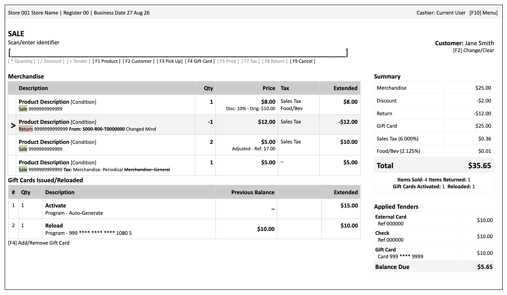

# POS transaction workspace follow-up

## Objective

Recompose the active transaction screen around the cashier’s workflow without replacing the existing Rails POS architecture.

The resulting workspace should organize the existing transaction components into:

1. register and session context;  
2. current mode and input prompt;  
3. merchandise and returns;  
4. gift-card activations and reloads;  
5. transaction summary;  
6. applied tenders.

The first slice improves clarity using behavior already supported by ShelfSense. The second slice adds the more substantial interaction changes.



---

# MVP: can do now

## Goal

Rearrange the existing transaction workspace into a coherent, keyboard-friendly surface while preserving current transaction, tender, completion, and authorization behavior.

This work should primarily compose existing records and calculations. It must not introduce a second transaction model or duplicate authoritative financial facts.

## Proposed layout

### Persistent context header

Display:

* store number and name;  
* register number;  
* business date;  
* current cashier;  
* F10 Register Menu affordance.

If there is an active session, navigating to Register should land directly on its working transaction workspace.

### Mode and prompt region

Display:

* current mode, such as `SALE`, `RETURN`, `TENDER`, or `PICKUP`;  
* concise instructions;  
* the active scan/input field;  
* the keyboard legend;  
* selected customer or `No customer`.

The input region should remain in a stable position as modes change.

### Merchandise section

Continue using `PosTransactionLine` as the authoritative source.

Display:

* selected-row indicator;  
* product description;  
* condition;  
* lookup identifier or SKU;  
* quantity;  
* selling unit price;  
* tax class;  
* extended line total.

Display returns with visually negative quantity and amount while preserving the existing positive stored quantity and explicit return direction.

Show relevant secondary details beneath the description or price:

* linked original transaction;  
* unlinked-return reason;  
* pickup allocation;  
* serialized-unit identifier;  
* original or reference price;  
* discount or price adjustment;  
* authorization/override status.

### Gift Cards section

Display `PosStoredValueIssuance` records as a section adjacent to or directly below merchandise.

Do not convert gift-card issuances into merchandise lines.

Display:

* activation or reload;  
* amount;  
* program;  
* system-generated selection;  
* masked card number when applicable.

Retain the existing gift-card workflow and current editing limitations for this slice.

The issuance prompt should use this field order:

1. Amount  
2. Program and system-generated/manual selection  
3. Scan or enter the card when applicable

### Transaction summary

Display a reconciled breakdown:

```
Merchandise
− Discount
− Returns
+ Gift cards issued
+ Tax by applicable group
= Total Due / Refund Due
```

Zero-value rows may be omitted when doing so does not make the calculation ambiguous.

The summary must derive from the existing transaction and line facts. It must not independently recalculate or persist another transaction total.

Use precise labels:

* `Gift cards issued`, not `Gift Card`;  
* `Total Due` for a positive signed net;  
* `Refund Due` for a negative signed net;  
* `Even Exchange` for a zero signed net with sale and return content.

Display supplementary counts:

* items sold;  
* items returned;  
* gift cards activated;  
* gift cards reloaded.

Item counts should use quantities, not merely the number of rows.

### Applied tenders

Rename the visible section from “Pending Tenders” to **Applied Tenders**.

Display the current `PosTender` records with:

* tender name;  
* applied amount;  
* masked identifier or safe reference when available;  
* cash presented and change;  
* stored-value remaining balance when already available from the current workflow.

Display the current settlement status below the list:

* Balance Due;  
* Refund Remaining;  
* Settled;  
* Even Exchange.

For this initial slice, preserve the current rule that tendering can be abandoned only as a whole. Do not make individual rows appear editable or removable until those actions are supported safely.

### Customer context

Display a stable customer area in the prompt region:

* selected customer name; or  
* `No customer`.

Retain F2 as the customer lookup/change action. Removing a customer should remain an explicit action rather than an ambiguous use of “Clear.”

## Keyboard presentation

Adopt the revised visible legend where the corresponding behavior already exists:

| Action | Key |
| :---- | :---- |
| Quantity | `*` |
| Discount | `/` |
| Tender | `+` |
| Product Search | `F1` |
| Customer Search | `F2` |
| Pickup | `F3` |
| Gift Card | `F4` |
| Price | `F5` |
| Tax Class | `F7` |
| Return | `F8` |
| Cancel Transaction | `F9` |
| Register Menu | `F10` |

The legend must not advertise actions that are unavailable or not implemented.

Existing working shortcuts may be retained temporarily where changing them would expand the slice. The exact contextual meanings of `-`, `Esc`, and tender-number sequences can be completed in the secondary work.

## Register Menu

Organize F10 actions by human workflow:

### Customer service

* Stored Value Inquiry  
* Transactions and Receipts

### Till activity

Include only actions available in the current release. Phase 11 actions may appear when their corresponding application work lands:

* Cash Drop  
* Cash Replenishment  
* Cash In  
* Cash Out

### Session

* X-Report  
* Close Session

Unavailable future actions should not appear as deceptive active controls.

## Responsive and accessibility requirements

The MVP surface must:

* work at the supported register resolution;  
* remain usable at 200% browser zoom;  
* preserve a logical DOM and keyboard order;  
* provide visible focus;  
* not communicate sale/return/selection state by color alone;  
* allow non-keyboard access to all active actions;  
* handle long product names, customer names, identifiers, and tender names;  
* move the summary below the basket at constrained widths rather than crushing the merchandise table.

## MVP acceptance scenarios

At minimum, verify:

1. ordinary multi-line sale;  
2. multi-quantity sale;  
3. discounted and price-adjusted lines;  
4. linked return;  
5. unlinked return;  
6. mixed sale and return;  
7. gift-card activation;  
8. gift-card reload;  
9. activation and reload on one transaction;  
10. cash tender with presented amount and change;  
11. split tender;  
12. gift-card or store-credit tender;  
13. payment transaction with balance remaining;  
14. refund transaction;  
15. even exchange;  
16. customer selected and no customer;  
17. pickup allocation;  
18. long product descriptions and identifiers;  
19. enough lines to overflow the basket;  
20. supported viewport and 200% zoom.

## MVP explicitly out of scope

Defer:

* editing one applied tender;  
* removing one applied tender;  
* atomic tender replacement;  
* stored-value requested-versus-applied prompting;  
* a new global contextual keyboard dispatcher;  
* changing all existing shortcut semantics;  
* new cash-management actions not yet delivered by Phase 11;  
* redesign of receipt output;  
* drag-and-drop or pointer-only reordering;  
* changes to transaction persistence or aggregate formulas.

---

# Secondary work: interaction completion

## Goal

Complete the cashier interaction model after the recomposed surface has established stable locations for merchandise, issuances, totals, and tenders.

## Contextual selection model

Introduce one coherent selection contract across:

* merchandise lines;  
* gift-card issuances;  
* applied tenders.

At any moment, the workspace should know:

* active mode;  
* active section;  
* selected record;  
* focused input;  
* whether a dialog is open;  
* which actions are permitted.

Selection must not rely only on a chevron or color. Use an accessible selected state and visible focus.

## Central keyboard dispatcher

Implement a mode-aware shortcut system with documented precedence.

It must distinguish between:

* transaction workspace shortcuts;  
* text entry;  
* modal/dialog shortcuts;  
* selected merchandise actions;  
* selected gift-card actions;  
* selected-tender actions;  
* browser and assistive-technology conventions.

Proposed completed mapping:

| Action | Key |
| :---- | :---- |
| Remove selected record | `-` |
| Quantity | `*` |
| Discount | `/` |
| Tender | `+` |
| Cash tender | `+1` |
| Check tender | `+2` |
| Credit-card tender | `+3` |
| Gift-card tender | `+4` |
| Store-credit tender | `+5` |
| Configured other tenders | `+6`–`+9` |
| Contextual back/clear | `Esc` |
| Product Search | `F1` |
| Customer Search | `F2` |
| Pickup | `F3` |
| Gift Card | `F4` |
| Price | `F5` |
| Tax Class | `F7` |
| Return | `F8` |
| Cancel Transaction | `F9` |
| Register Menu | `F10` |

The system must not intercept a printable character when the cashier is typing into an applicable field.

`Esc` behavior must be explicitly defined by context. Recommended precedence:

1. close the active dialog without committing;  
2. leave the current submode;  
3. clear the current prompt;  
4. do nothing if no reversible contextual action exists.

It should never silently cancel the transaction.

## Tender workflow redesign

Replace the all-or-nothing tender workflow with:

```
Tender selection → Tender entry → Tender review → Completion
```

### Tender review

Applied tender rows become selectable.

Available actions:

* edit the selected tender;  
* remove the selected tender;  
* add another tender;  
* return to sale;  
* complete when exactly settled.

### Edit tender

Editing must use atomic replacement:

1. load the existing tender into its tender-specific prompt;  
2. preserve the existing tender while replacement values are entered;  
3. validate the replacement;  
4. reverse or replace any associated stored-value effect safely;  
5. commit the replacement atomically;  
6. recalculate remaining due;  
7. retain the original tender unchanged if replacement fails.

Do not implement editing as “delete first, then attempt to add.”

### Remove tender

Removing a tender must:

* target a specific tender;  
* reverse associated stored-value effects when applicable;  
* remain idempotent;  
* recalculate settlement immediately;  
* prevent double reversal or removal;  
* preserve an adequate audit relationship.

### Return to sale

Returning to sale should be a clearly labeled action.

If existing business rules require tender removal before modifying commercial content, the action must explain that it will remove all applied tenders and require explicit confirmation.

“Cancel tendering” should not be confused with cancelling the transaction.

## Stored-value tender behavior

For gift card, store credit, and future trade credit:

1. Default requested amount to the current balance due.  
2. Allow the cashier to enter another requested payment amount.  
3. Reject a request greater than the remaining transaction balance.  
4. Revalidate the stored-value account.  
5. Apply:

```
actual applied =
  min(requested amount, available stored-value balance)
```

6. Persist only the actual applied tender.  
7. Display any difference clearly.  
8. Recalculate the remaining transaction balance.

Example:

```
Balance due:       $30.00
Requested payment: $30.00
Available credit:  $18.00
Applied:           $18.00
Remaining due:     $12.00
```

Completion must revalidate the available balance to protect against concurrent use.

## Gift-card issuance editing

Make gift-card issuance rows selectable.

Support:

* edit amount before completion;  
* change program or number authority where still legal;  
* supply or replace the scanned card before activation;  
* remove the issuance;  
* preserve the original issuance if replacement validation fails.

The prompt retains the agreed sequence:

1. Amount  
2. Program/system-generated selection  
3. Enter or scan card, when applicable

The system should infer activation versus reload from the selected/scanned card state where reliable, while explaining the result to the cashier.

## Tax-summary projection

Extract or reuse a shared tax-group projection so that:

* transaction workspace;  
* completion screen;  
* customer receipt;  
* reprinted receipt

derive tax groups consistently.

The projection must net sale and return tax within each applicable group and reconcile to:

```
transaction.tax_cents − transaction.return_tax_cents
```

## Secondary acceptance scenarios

In addition to the MVP scenarios, verify:

1. edit each supported tender type;  
2. remove an arbitrary tender from a split payment;  
3. replacement failure preserves the original;  
4. cash edit recalculates presented amount and change;  
5. stored-value request below available balance;  
6. stored-value request equal to available balance;  
7. stored-value request above available but below amount due;  
8. stored-value request above amount due fails;  
9. account balance changes concurrently before completion;  
10. remove stored-value tender restores value exactly once;  
11. return to sale with applied tenders;  
12. edit and remove gift-card issuance;  
13. keyboard selection across all three sections;  
14. shortcut handling while typing;  
15. modal Escape precedence;  
16. permission-denied and approval-required actions;  
17. stale transaction lock during edit;  
18. recovery after an external tender failure;  
19. screen reader announcement of mode and remaining balance;  
20. pointer-only completion of every workflow.

## Recommended delivery sequence

1. **POS UX 1 — Transaction composition MVP**  
2. **POS UX 2 — Selection and keyboard framework**  
3. **POS UX 3 — Tender review and atomic editing**  
4. **POS UX 4 — Stored-value and gift-card interaction completion**

This keeps the first deliverable mostly presentational and low-risk while giving the secondary work explicit contracts for the places where behavior, concurrency, and financial reversals matter.  