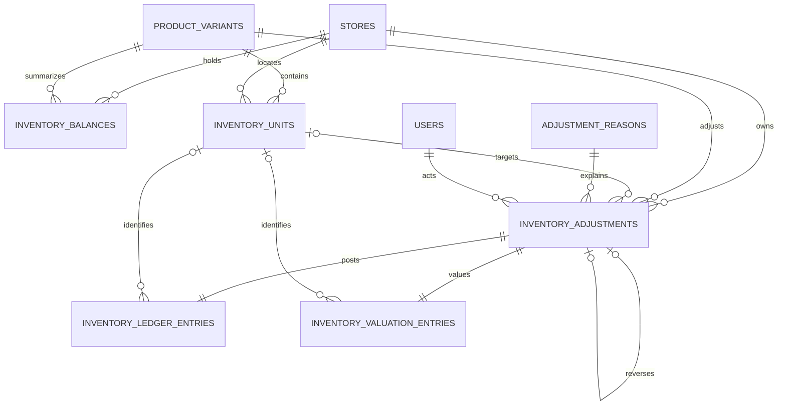

# Phase 3 — Inventory Foundation

## Status

Implemented.

## 1. Purpose

Phase 3 establishes ShelfSense's authoritative physical-inventory and inventory-valuation foundation.

After this phase, an authorized user can:

- establish opening inventory at a store;
- add or remove physical inventory through a controlled single-effect adjustment;
- acquire and remove individually tracked units;
- view current on-hand quantity and carrying value;
- review the immutable physical and valuation history supporting those balances;
- reverse an eligible erroneous adjustment without rewriting history; and
- detect and repair projection drift through explicit reconciliation.

Phase 3 models physical on-hand inventory and valuation only. Purchasing, POS, reservations, availability holds, transfers, and return-to-supplier workflows are deferred. Later workflows must use the posting boundary established here.

## 2. Locked decisions

| Topic | Decision |
|---|---|
| Physical authority | `inventory_ledger_entries` is the immutable authority for physical on-hand quantity. |
| Valuation authority | `inventory_valuation_entries` is the immutable authority for carrying value. |
| Projection | `inventory_balances` is a rebuildable store/variant projection. |
| Adjustment shape | One adjustment has one store, one variant, and one physical effect; there are no headers and lines. |
| Tracking | Tracking remains derived from Phase 2 merchandise-class and variant fields; Phase 3 adds no second tracking column. |
| Quantity costing | Moving weighted average over authoritative integer-cent total value and quantity. |
| Individual costing | Specific identification using the unit's integer-cent carrying value. |
| Money | All committed monetary amounts use integer `_cents` fields. Fractional average cost is a derived ratio, not stored authority. |
| Negative stock | Phase 3 posting implements only `reject_below_zero`. `inventory_balances` require nonnegative quantity and value. ADR-014 `allow_below_zero` is a documented future extension and is not callable in Phase 3. |
| Availability | Reservations and unavailable allocations are deferred; in Phase 3, `available = on_hand`. |
| Conditions | Condition belongs to the product variant. An inventory unit cannot override it. |
| Unit sell price | Phase 3 adds `inventory_units.regular_price_cents`, defaulted from `product_variants.regular_price_cents` at acquisition and overridable for that copy. Valuation uses acquisition/carrying value, not this field. Later unit price correction is an audited pricing workflow outside Phase 3. **Changed from an earlier revision that deferred this column.** |
| Immutability | Posted adjustments and ledger entries are not edited or deleted normally. Corrections use reversal or a new adjustment. |
| Concurrency | Posting uses a pessimistic balance-row lock; `lock_version` serves stale-form detection where applicable. |
| Idempotency | Commands use the scoped ADR-009 operation record and payload hash, including lease-based recovery of stale `in_flight` operations and same-payload retry of `failed` operations. |
| Identifiers | UUIDv7 applies to domain PKs/FKs. Scannable identifiers follow the **implemented** Phase 2 contract and the identifier registry. |
| Operational dates | Inventory facts persist `business_date` with `occurred_at` and `posted_at`. `business_date` is the store-local operational date derived from the accepted `occurred_at`. **Changed from an earlier revision that deferred stored `business_date`.** |
| Currency | Inventory valuation uses the system base currency; mixed-currency inventory is deferred. |
| Platform events | Phase 3 introduces ADR-010 transactional outbox recording for inventory domain events if absent. |

## 3. Scope

### 3.1 Included

- shared ADR-009 idempotency-operation infrastructure (introduced here if absent);
- shared ADR-010 transactional outbox infrastructure (introduced here if absent);
- adjustment reasons;
- posted-only, single-effect physical adjustments;
- immutable physical and valuation ledgers;
- store/variant balance projections;
- moving-weighted-average costing using integer cents;
- individually tracked units with unit-level `regular_price_cents` and specific-identification costing;
- exact reversal of eligible Phase 3 adjustments;
- history, overview, reconciliation, and controlled projection rebuilding;
- authorization (including `inventory.backdate`), audit, concurrency, idempotency, business-date, and outbox integration; and
- model/service unit and request/integration tests.

### 3.2 Deferred

- purchasing, receipts, landed cost, and supplier-document currencies;
- POS sales, returns, suspended transactions, and offline consolidation;
- reservations, `reserved_quantity`, and reservation allocations;
- generic unavailable allocations and `unavailable_quantity`;
- damage, inspection, and return-to-supplier holds that remain physically owned;
- transfers and in-transit inventory;
- valuation-only adjustments and write-down workflows;
- lot, batch, expiration-date, and physical-count sessions;
- FIFO, LIFO, standard-cost, and retail valuation;
- COGS and general-ledger posting;
- negative carrying-value policy under `allow_below_zero`; and
- backdated replay of subsequent valuation events.

The long-term invariant remains:

```text
available = on_hand - reserved - unavailable
```

In Phase 3 both deferred terms are zero:

```text
available = on_hand
```

No speculative reservation or unavailability tables or balance columns are created.

## 4. Phase 2 contracts

### 4.1 Derived inventory tracking

Phase 3 consumes the existing Phase 2 derivation:

```text
merchandise_class.inventory_mode + product_variant.variant_type
    -> quantity | individual | non_inventory
```

`ProductVariant#derived_inventory_tracking` remains the single source of truth. Phase 3 does not add `product_variants.inventory_tracking_method`.

Once a variant has inventory history—including a balance, inventory unit, physical entry, or valuation entry—application validation must reject merchandise-class or variant-type edits whose new derived tracking result would differ from the historical result. Edits that preserve the same derived tracking remain allowed. A future migration workflow may reclassify tracking explicitly.

`non_inventory` or nil-derived variants are rejected by all inventory operations. They receive no balances, units, adjustments, or ledger entries.

### 4.2 Identifiers

Phase 3 does not change the **implemented** Phase 2 identifier contract:

- product `primary_identifier` is stored as a normalized 13-digit value under the current schema constraints;
- ShelfSense-generated product identifiers use EAN-13 prefix `222`;
- ShelfSense-generated variant SKUs use EAN-13 prefix `221` with a valid check digit;
- manufacturer-assigned product identifiers accepted at create still pass through the Phase 2 normalization and validation path currently enforced by the application and database.

Any looser manufacturer-identifier narrative (non-EAN shapes, format-specific validation without forcing 13 digits) is future ADR / Phase 2 follow-up work—not present behavior and not in Phase 3 scope.

Inventory units require immutable scannable identifiers. The proposed generated namespace is EAN-13 prefix `220`, subject to acceptance in the identifier ADR before implementation. Unit issuance and retirement must use the existing identifier registry and tombstone rules. ShelfSense-generated `220`, `221`, and `222` identifiers are non-reusable within the established registry scope.

### 4.3 Variant-owned condition and unit sell price

An inventory unit inherits condition from its parent variant and has no `merchandise_condition_id`. Changing a unit's condition requires a controlled reclassification to the corresponding condition-specific variant; that workflow is deferred.

A unit may differ from its parent variant in:

- acquisition cost (`acquisition_cost_cents`);
- current carrying value (`carrying_value_cents`); and
- selling price (`regular_price_cents`), a **Phase 3** column on `inventory_units`.

At acquisition, `inventory_units.regular_price_cents` defaults from `product_variants.regular_price_cents` when that variant price is present. The acquisition form may override the default under the same nonnegative integer-cent rules. After posting, price changes are limited to authorized descriptive correction (audited); they do not rewrite historical valuation entries.

Selling and display use the unit's `regular_price_cents` when present; otherwise fall back to the parent variant's `regular_price_cents`. Phase 2 established only the variant-level field—do not claim a pre-existing unit price column.

## 5. Domain model

### 5.1 Physical and valuation effects

A Phase 3 physical posting atomically creates:

1. one posted `inventory_adjustment` as business source;
2. one `inventory_ledger_entry` containing the signed physical effect;
3. one `inventory_valuation_entry` containing the signed integer-cent value effect;
4. the corresponding unit creation or lifecycle transition when individually tracked;
5. an update to `inventory_balances`;
6. an audit event; and
7. the ADR-010 outbox event(s) required for the committed change.

For an individually tracked variant, the physical effect references exactly one unit and has magnitude one.

### 5.2 Inventory units

An `inventory_unit` represents one distinct physical copy of an individually tracked variant.

Phase 3 lifecycle states are:

- `on_hand`: included in physical inventory; and
- `removed`: removed by a Phase 3 adjustment.

Future disposition terms such as `sold`, `return_to_supplier`, and `transferred` belong to their respective workflows. Units are not normally deleted. Removed units retain their parent variant, last/current owning store, identifier, costs, price, and history.

### 5.3 Currency and valuation

All Phase 3 carrying values are denominated in `system_settings.base_currency_code` or the repository's equivalent base-currency setting. Mixed-currency balances and valuation entries are not supported.

Quantity-tracked inventory stores two authoritative values:

```text
on_hand_quantity
inventory_value_cents
```

Its mathematical average unit cost is derived:

```text
inventory_value_cents / on_hand_quantity
```

The derived ratio may contain fractional cents but is not stored as authoritative money.

Individually tracked inventory uses:

- `acquisition_cost_cents`: historical cost, immutable except controlled correction of an input error; and
- `carrying_value_cents`: current value relieved when the unit leaves inventory.

They normally begin equal in Phase 3.

## 6. Entity-relationship diagram



The one-to-one ledger relationships apply to Phase 3 adjustments. `source_type`, `source_id`, and `effect_sequence` allow future sources to create multiple effects without redesigning the ledgers.

## 7. Schema

All domain tables use UUIDv7 PKs/FKs. Mutable records use normal timestamps; immutable ledgers require `created_at` but not `updated_at`. Operational timestamps are `timestamptz`.

### 7.1 `adjustment_reasons`

| Column | Type | Constraints / notes |
|---|---|---|
| `id` | uuid | PK; UUIDv7 |
| `code` | string | Required; normalized; unique; immutable after use |
| `name` | string | Required |
| `description` | text | Optional |
| `direction` | string | `increase`, `decrease`, or `either` |
| `cost_required_for_increase` | boolean | Required; default `true` |
| `notes_required` | boolean | Required; default `false` |
| `allows_quantity_tracking` | boolean | Required; default `true` |
| `allows_individual_tracking` | boolean | Required; default `true` |
| `system_protected` | boolean | Required; default `false` |
| `active` | boolean | Required; default `true` |
| `lock_version` | integer | Required; default `0` |
| timestamps | timestamptz | Required |

Seed at least `opening_inventory`, `found_inventory`, `shrinkage`, `damage_removal`, `data_correction`, and a system-protected `reversal`. Used reasons are deactivated, not deleted. A reason explains an effect; it does not choose costing behavior.

### 7.2 `inventory_adjustments`

Adjustments are persisted only when confirmed and successfully posted. There are no drafts. Queries treat `reversed_at IS NOT NULL` as reversed; the reversing row is identified by a populated `reversal_of_id`. Business fields remain immutable after post; `reversed_at` is the only lifecycle mutation on the original. Concurrent reverse attempts are serialized by unique `reversal_of_id` plus ADR-009.

| Column | Type | Constraints / notes |
|---|---|---|
| `id` | uuid | PK; UUIDv7 |
| `store_id` | uuid | Required FK |
| `product_variant_id` | uuid | Required FK |
| `inventory_unit_id` | uuid | Nullable FK; required for individual removals and assigned during individual acquisition |
| `adjustment_reason_id` | uuid | Required FK |
| `quantity_delta` | integer | Required; nonzero; individual effects are `+1` or `-1` |
| `acquisition_unit_cost_cents` | integer | Nullable; nonnegative; required for increases when reason policy requires it |
| `notes` | text | Optional unless required by reason |
| `created_by_id` | uuid | Required user FK for Phase 3 UI; transitional relative to ledger `actor_type`/`actor_id` (future POS/system actors do not require redesigning the posting service) |
| `business_date` | date | Required store-local operational date |
| `occurred_at` | timestamptz | Required effective time |
| `posted_at` | timestamptz | Required commit time |
| `reversal_of_id` | uuid | Nullable self-FK; unique when present |
| `reversed_at` | timestamptz | Nullable; set on original after successful reversal |
| timestamps | timestamptz | Required |

The record's existence means it posted successfully. Idempotency is not implemented by a unique key on this table. The adjustment may optionally reference the ADR-009 operation record for traceability.

### 7.3 `inventory_ledger_entries`

| Column | Type | Constraints / notes |
|---|---|---|
| `id` | uuid | PK; UUIDv7 |
| `store_id` | uuid | Required FK |
| `product_variant_id` | uuid | Required FK |
| `inventory_unit_id` | uuid | Nullable; required for individual effects |
| `quantity_delta` | integer | Required; nonzero |
| `entry_type` | string | Initially `adjustment` or `reversal`; extensible |
| `source_type`, `source_id` | string, uuid | Required polymorphic business source |
| `effect_sequence` | integer | Required; nonnegative; default `0` |
| `business_date` | date | Required |
| `occurred_at` | timestamptz | Required |
| `actor_type`, `actor_id` | string, uuid | Actor abstraction compatible with future system/POS actors |
| `reversal_of_id` | uuid | Nullable self-FK; unique when present |
| `created_at` | timestamptz | Required |

Unique index:

```text
(source_type, source_id, effect_sequence)
```

Rows are append-only and cannot be directly created through public controllers or ordinary models.

### 7.4 `inventory_valuation_entries`

| Column | Type | Constraints / notes |
|---|---|---|
| `id` | uuid | PK; UUIDv7 |
| `store_id` | uuid | Required FK |
| `product_variant_id` | uuid | Required FK |
| `inventory_unit_id` | uuid | Nullable; required for individual effects |
| `quantity_delta` | integer | Required; matches related physical effect |
| `value_delta_cents` | integer | Required signed authoritative value effect |
| `acquisition_unit_cost_cents` | integer | Nullable; actual incoming per-unit cost when applicable |
| `valuation_method` | string | `moving_average` or `specific_identification` |
| `entry_type` | string | `acquisition`, `depletion`, or `reversal` initially |
| `source_type`, `source_id` | string, uuid | Required polymorphic source |
| `effect_sequence` | integer | Required; nonnegative; default `0` |
| `calculation_metadata` | jsonb | Optional costing snapshot such as prior quantity/value; never authority |
| `business_date` | date | Required |
| `occurred_at` | timestamptz | Required |
| `reversal_of_id` | uuid | Nullable self-FK; unique when present |
| `created_at` | timestamptz | Required |

No decimal applied-unit-cost field is required. `quantity_delta` and `value_delta_cents` are authoritative. A derived effective rate may be displayed from them.

Unique index:

```text
(source_type, source_id, effect_sequence)
```

### 7.5 `inventory_balances`

| Column | Type | Constraints / notes |
|---|---|---|
| `id` | uuid | PK; UUIDv7 |
| `store_id` | uuid | Required FK |
| `product_variant_id` | uuid | Required FK |
| `on_hand_quantity` | integer | Required; default `0`; `CHECK (on_hand_quantity >= 0)` |
| `inventory_value_cents` | integer | Required; default `0`; `CHECK (inventory_value_cents >= 0)`; `CHECK (on_hand_quantity <> 0 OR inventory_value_cents = 0)` |
| `lock_version` | integer | Required; default `0` |
| timestamps | timestamptz | Required |

Unique index:

```text
(store_id, product_variant_id)
```

Do not store average, reserved, unavailable, or available quantity. When on-hand is zero, value must be zero; the database enforces that with a check constraint. Phase 3 posting rejects any policy other than `reject_below_zero`; the database checks also enforce the nonnegative projection.

### 7.6 `inventory_units`

| Column | Type | Constraints / notes |
|---|---|---|
| `id` | uuid | PK; UUIDv7 |
| `product_variant_id` | uuid | Required FK; derived tracking must be `individual` |
| `store_id` | uuid | Required FK; current or last owning store |
| `unit_identifier` | string | Required; normalized; immutable; registry-backed |
| `lifecycle_state` | string | `on_hand` or `removed` |
| `acquisition_cost_cents` | integer | Required; nonnegative |
| `carrying_value_cents` | integer | Required; nonnegative |
| `regular_price_cents` | integer | Nullable; nonnegative; Phase 3 unit sell price; defaults from parent variant at acquisition |
| `notes` | text | Optional copy-specific description |
| `removed_at` | timestamptz | Null on hand; required when removed |
| `lock_version` | integer | Required; default `0` |
| timestamps | timestamptz | Required |

There is no unit condition column. The parent variant is the condition-bearing record.

## 8. Command and posting contract

### 8.1 Idempotency under ADR-009

The repository does not yet ship a general idempotency-operation table. Phase 3 introduces the shared ADR-009 operation record (and supporting service) as a platform prerequisite, then uses it for inventory commands. Uniqueness is:

```text
(source_id, operation_type, idempotency_key)
```

with canonical payload hash, operation status, stored result/reference, a 2-minute `lease_expires_at` on `in_flight` rows, `lock_version`, and retention long enough for retries. Stale `in_flight` leases may be reclaimed; `failed` operations with the same payload may retry. Required operation types include:

```text
post_inventory_adjustment
reverse_inventory_adjustment
rebuild_inventory_projection
```

For administrative HTML flows, `source_id` is a **server-issued command token** (UUIDv7) bound to the preview/confirm workflow—not the user id alone. An identical retry returns the prior result. Reuse with a different payload is an error. The operation mechanism must safely represent in-flight, completed, and failed attempts as required by ADR-009.

### 8.2 Atomic transaction and locking

Posting performs the following in one transaction:

1. authorize the actor and store scope;
2. resolve the ADR-009 operation and validate its payload hash;
3. derive and validate tracking; reject `non_inventory`;
4. validate reason, request, business date, and source policy;
5. lock the balance with `SELECT ... FOR UPDATE` or equivalent;
6. safely create an absent balance under the unique store/variant constraint, retrying a concurrent insert race;
7. lock or create the target inventory unit when applicable;
8. recompute quantity and value effects under lock;
9. apply the caller's authorized negative-stock policy;
10. persist adjustment, ledgers, unit transition, projection, audit, and required outbox records;
11. mark the idempotency operation completed and commit.

The UI may send `lock_version` to detect stale editable forms. It does not replace the pessimistic posting lock.

No controller, callback, import, or future workflow may update balances directly.

### 8.3 Negative-stock policy

Phase 3 posting implements only:

```text
reject_below_zero
```

Any other policy, including `allow_below_zero`, is rejected. Resulting on-hand quantity and carrying value must be nonnegative. `inventory_balances` enforce both with database checks.

ADR-014 remains a documented future extension for POS/offline consolidation. Phase 3 does not make `allow_below_zero` callable, and does not define negative carrying-value semantics.

### 8.4 Business date and backdating

`posted_at` records commit time. `occurred_at` records effective event time. `business_date` records the store-local operational date under ADR-007, derived from the **accepted** `occurred_at` in the store's timezone. Ledger and valuation rows copy the adjustment's business date.

Without `inventory.backdate`, a supplied `occurred_at` is ignored and the server uses `Time.current`. With `inventory.backdate`, an earlier effective timestamp may be accepted within documented limits. Future timestamps are always rejected. Ordinary posting still cannot precede the latest inventory event for the same store/variant unless `inventory.backdate` is granted. Materially backdated valuation replay remains deferred.

### 8.5 Outbox

The repository does not yet ship transactional outbox tables. Phase 3 introduces ADR-010 outbox infrastructure (or a documented, accepted deferral with an atomic recording extension point) and records inventory domain events in the same posting transaction, including at least:

```text
inventory.adjustment_posted
inventory.adjustment_reversed
inventory.projection_rebuilt
```

Phase 3 must not silently bypass ADR-010.

## 9. Costing rules

### 9.1 Quantity-tracked increase

For positive quantity `q` at integer-cent acquisition cost `c`:

```text
incoming_value_cents = q * c
new_quantity          = old_quantity + q
new_value_cents       = old_value_cents + incoming_value_cents
```

### 9.2 Quantity-tracked decrease

For removal magnitude `r`:

```text
value_removed_cents = round_half_up(
  current_inventory_value_cents * r / current_on_hand_quantity
)
```

If all remaining quantity is removed:

```text
value_removed_cents = current_inventory_value_cents
```

The final-depletion rule guarantees zero quantity and zero value without stranded rounding residue. Intermediate fractional value remains embedded in the carrying value of remaining inventory.

### 9.3 Individually tracked increase

- quantity is `+1`;
- identifier and integer-cent acquisition cost are required;
- one on-hand unit is created;
- `regular_price_cents` defaults from the parent variant and may be overridden on the acquisition form;
- acquisition and carrying values begin equal; and
- aggregate quantity and value increase by one and by that carrying value.

### 9.4 Individually tracked decrease

- quantity is `-1`;
- the target unit must be on hand at the same store and under the same variant;
- its complete carrying value is relieved;
- it transitions to `removed` and receives `removed_at`; and
- aggregate quantity and value decrease by one and the exact carrying value.

## 10. Preview and confirmation

The adjustment form creates no persistent draft. The server computes a preview using the same costing implementation used by posting.

Posting, reversal, and projection rebuilding use server-rendered confirmation pages. They do not rely on Turbo confirmations or browser-only JavaScript.

Final posting recomputes under lock and never trusts quantities, values, business dates, or eligibility copied from the preview response. Cancelling a preview leaves no adjustment record and reserves neither unit nor idempotency key beyond ADR-009's command semantics (the server-issued command token may remain usable for an identical retry of the same payload).

## 11. Reversal and correction

A reversal is a new posted adjustment that exactly negates the original stored quantity and value effects. It does not recalculate current average cost.

Rules:

- only an unreversed Phase 3 adjustment may be reversed;
- the reversing adjustment has its own actor, business date, timestamps, idempotency operation, and required explanation;
- it uses the system-protected reversal reason and references the original through `reversal_of_id`;
- physical and valuation entries use reversal-specific entry types and reference their originals;
- quantity and `value_delta_cents` are the exact negations of the originals;
- any original `acquisition_unit_cost_cents` may be copied for traceability but is not recalculated;
- an original may be reversed successfully at most once;
- the reversal remains subject to Phase 3's `reject_below_zero` policy;
- unit acquisition can be reversed only while the unit remains on hand and untouched by later lifecycle activity; and
- unit removal can be reversed only while the unit remains removed and unclaimed by later workflow.

If intervening activity makes exact reversal invalid, reject it and require a new correcting adjustment based on current facts.

## 12. Reconciliation and rebuilding

Read-only reconciliation calculates:

```text
expected on hand = sum(inventory_ledger_entries.quantity_delta)
expected value   = sum(inventory_valuation_entries.value_delta_cents)
```

For individual tracking it also verifies:

```text
expected on hand = count(on-hand inventory_units)
expected value   = sum(on-hand inventory_units.carrying_value_cents)
```

It reports missing balances (including valuation-only history); quantity/value drift; zero-quantity residual value; missing physical/valuation pairs in both directions; paired rows that disagree on store, variant, unit, quantity, or effective date; unit aggregate mismatch; and unit store/variant/lifecycle inconsistency.

Projection rebuilding is separately authorized and confirmed. It locks the selected scope, refuses to run while any pair-integrity drift exists for that store/variant, reconstructs projections from authoritative entries, verifies unit aggregates, replaces projections in one transaction, records audit/outbox effects, and never changes adjustments, ledgers, or unit history. Unpaired or mismatched authority must be repaired before a rebuild can legitimize the projection.

## 13. Authorization and audit

Recommended permissions:

- `inventory.view`;
- `inventory.adjust`;
- `inventory.reverse_adjustment`;
- `inventory.manage_adjustment_reasons`;
- `inventory.reconcile`; and
- `inventory.backdate`.

Store-scoped assignments apply only to their store. System-protected reason changes and projection rebuilding may require global authority. `inventory.backdate` authorizes earlier-than-default `occurred_at` / derived `business_date` within the limits in §8.4.

The service accepts an actor abstraction; Phase 3 UI actors are users (`created_by_id` on adjustments), while ledger rows use `actor_type`/`actor_id` so future system/POS actors do not require a schema redesign of the posting path.

Audit is required for reason configuration, adjustment posting, reversal, authorized unit descriptive correction (including unit sell-price correction), failed exceptional policy use where required, and projection rebuilding. Metadata includes store, variant, unit, reason, business date, quantity/value effects, source, idempotency reference, and relevant before/after values.

## 14. Administrative UX

Phase 3 remains server-rendered Rails HTML with the accepted administrative UX foundation and no Turbo/Stimulus/Node/Tailwind/ViewComponent/SPA installation.

### 14.1 Inventory overview

- default to the user's permitted store scope;
- paginate at 50 rows;
- search by normalized exact or prefix product/variant identifier using Phase 2 normalization rules;
- optionally filter by derived tracking method;
- show on-hand quantity, carrying value, and derived average cost where applicable;
- show individual-unit count for individual tracking; and
- link to history and authorized actions.

Broad title search and advanced availability filters are out of scope unless already supplied by a shared Phase 2.2 query component. Unit `220` identifier lookup belongs on unit/history screens unless the overview search is explicitly extended later.

### 14.2 History and adjustment

- show paired physical/value effects, source, actor, business/effective/posting dates, unit, and reversal links;
- adapt form fields to derived tracking;
- require or generate a unit identifier for individual acquisition;
- accept optional unit `regular_price_cents` (defaulted from the variant);
- do not request a separate unit condition;
- preview through production costing code; and
- use server-rendered confirmation pages for consequential actions.

### 14.3 Reasons and reconciliation

- deactivate used reasons instead of deleting them;
- prevent editing protected reason behavior;
- present reconciliation as read-only by default; and
- separate projection rebuilding behind explicit permission and confirmation.

## 15. Invariants and database protection

1. Physical and valuation ledgers are the respective authorities.
2. Balances are projections reconstructible from authoritative rows.
3. Tracking is derived from Phase 2 fields; no duplicate tracking column exists.
4. A derived `non_inventory` variant has no inventory records.
5. Class/type edits that would change derived tracking after history exists are rejected.
6. Phase 3 admin operations do not make on-hand or value negative.
7. Zero on-hand requires zero carrying value.
8. Physical, valuation, unit, balance, audit, outbox, and idempotency completion commit atomically as applicable.
9. Every Phase 3 adjustment produces exactly one physical and one valuation entry.
10. Posted facts and ledgers are append-only; correction uses reversal or a new posting.
11. Reversal exactly negates stored effects and occurs at most once.
12. Identical command retries cannot duplicate effects; payload mismatch is an error.
13. Individual effects have magnitude one and reference one unit.
14. An on-hand unit contributes one quantity and its carrying value to its parent balance.
15. A removed unit contributes neither quantity nor value.
16. A unit's parent variant supplies its condition; no unit override exists.
17. Unit variant and identifier are immutable after acquisition.
18. Generated unit identifiers are registry-backed and non-reusable.
19. Aggregate individual quantity/value equals on-hand unit count/value.
20. Unit `regular_price_cents` is Phase 3 sell-price state; it does not rewrite valuation history when corrected.
21. Phase 3 has no reserved or unavailable authority; available equals on-hand.

Back database-enforceable rules with FKs, unique indexes, check constraints, and append-only database protection where practical. Cross-row rules belong in the locked posting service and concurrency tests.

## 16. Testing requirements

Use service/model unit and request/integration tests; no browser system-test suite or new CI job is required.

Cover:

- derived tracking, tracking-immutability rejection when derivation would change, and `non_inventory` rejection;
- quantity increases, proportional integer-cent depletion, half-up rounding, and exact final depletion;
- unit acquisition/removal, variant-owned condition, and unit `regular_price_cents` default/override;
- atomic quantity/value/unit/balance/audit/outbox posting;
- introduction and use of scoped ADR-009 operations, including server-issued admin `source_id`, in-flight retry, identical retry, and payload mismatch;
- pessimistic locking, concurrent balance creation, stale forms, and oversubtraction prevention;
- Phase 3 rejection of negative inventory and inability of public callers to select an exception;
- exact reversal, one-reversal limit, intervening-activity rejection, and unchanged historical costing;
- business-date derivation, `inventory.backdate`, and ordinary backdating limits;
- identifier search/normalization under the implemented Phase 2 contract and unit registry integration;
- server-rendered previews/confirmations and recomputation under lock;
- reconciliation drift detection and atomic audited rebuild; and
- store-scoped authorization and immutable-route protection.

## 17. Implementation sequence

1. Confirm the `220` unit namespace and identifier-registry/tombstone contract in the identifier ADR.
2. Lock the Phase 2 derived-tracking contract and reject tracking-changing class/type edits after history.
3. Introduce shared ADR-009 idempotency-operation tables/services and ADR-010 outbox tables/services (or document an accepted delivery deferral with an atomic recording hook); align business dates with ADR-007.
4. Create reasons, posted adjustments, physical ledger, valuation ledger, and balances using integer cents only.
5. Implement atomic quantity posting with pessimistic locking, negative-stock policy, proportional value allocation, audit, and outbox integration.
6. Implement exact reversal and correcting-adjustment behavior.
7. Add inventory units with parent-variant condition inheritance and Phase 3 `regular_price_cents` (default from variant).
8. Implement reconciliation and explicit projection rebuilding.
9. Build paginated administrative views and server-rendered confirmation workflows (including server-issued command tokens).
10. Complete permissions (including `inventory.backdate`), immutability protection, request/integration, concurrency, and acceptance tests.
11. Keep `docs/planning/README.md` aligned with this specification (single-effect adjustments; no speculative availability columns).
12. Document the posting-service contract for later purchasing, POS, transfer, reservation, and disposition phases.

## 18. Acceptance criteria

Phase 3 is complete when:

1. authorized users can establish and adjust quantity- and individually tracked inventory;
2. `non_inventory` variants cannot acquire inventory records;
3. tracking remains derived and class/type edits that would change derivation after history are rejected;
4. quantity/value/unit/projection/audit/outbox effects commit atomically;
5. all committed money remains integer cents;
6. quantity costing uses the specified proportional allocation and ends final depletion at zero value;
7. individual costing relieves the selected unit's exact carrying value;
8. Phase 3 operations cannot reduce on-hand below zero, while the posting boundary preserves the ADR-014 quantity extension point without defining negative value semantics;
9. posted records and ledgers cannot be edited or normally deleted;
10. eligible errors can be exactly reversed once without revaluation;
11. ADR-009 retries cannot duplicate effects or accept changed payloads, using server-issued admin command tokens where applicable;
12. concurrent postings preserve quantity and value;
13. business date, `inventory.backdate`, base currency, authorization, audit, and event contracts are explicit and enforced;
14. overview/history/confirmation/reconciliation screens satisfy the bounded server-rendered UX contract;
15. reconciliation detects drift and authorized rebuilding repairs projections without altering authority;
16. units inherit condition from variants and store Phase 3 unit-specific cost, value, and `regular_price_cents`;
17. shared ADR-009 and ADR-010 infrastructure exists (or an accepted deferral with an atomic hook is documented);
18. no reservation, unavailable-allocation, purchasing, transfer, or POS workflow is introduced; and
19. the automated suite covers the specified posting, costing, unit, reversal, idempotency, concurrency, authorization, and reconciliation behaviors.

## 19. Deliverable

ShelfSense can establish opening inventory, adjust physical inventory, track specifically identified units, maintain immutable quantity and integer-cent value history, and present reliable current on-hand and carrying-value projections. The posting layer provides a controlled extension point for later purchasing, POS, transfer, reservation, and disposition workflows without prematurely implementing those domains.
