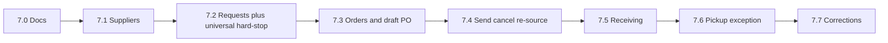

# Phase 7 — Orders, customer requests, and receiving

## Status

Accepted / application slices 7.1–7.7 complete on integration branch `phase-7-orders-and-receiving`. Phase 7 is marked implemented on `main` only after the [manual test gate](phase7-manual-test-gate.md), review, and final integration → `main` merge.

Authority: [phase7-spec.md](phase7-spec.md), [phase7-schema.md](phase7-schema.md), [phase7-workflows.md](phase7-workflows.md), [phase7-lock-order.md](phase7-lock-order.md), [phase7-user-stories.md](phase7-user-stories.md), [phase7-manual-test-gate.md](phase7-manual-test-gate.md).

## Goal

Ship a bookstore-operable path: configure suppliers → create stock or quantity-one customer requests → locate/reserve or special-order Standard merchandise → send POs → receive → withhold reserved stock → complete pickup on the existing Register → close POs.

Accounting AP, landed-cost capitalization, replenishment automation, and supplier returns stay deferred.

## Locked decisions

- Keep user-facing **Order** (`orders`); disambiguate with **Purchase order** / Stock order / Customer special order.
- One internal order → one PO line; consolidation deferred.
- Hard availability: `available = on_hand - active_reserved - unavailable` (`unavailable = 0` in Phase 7).
- **Universal hard-stop lands in Slice 7.2** for every already-implemented stock-depleting path (including ordinary `Inventory::PostSale`). **Slice 7.6 adds only** the allocation-linked pickup exception and fulfillment lifecycle.
- Pickup only via Register + allocation-linked POS line; no admin “mark completed.”
- Reservation expiration settings remain configuration-only.
- Purchasing ops workspaces (location, draft PO, receiving) are Register-class siblings of POS; do not fold POS into a shared shell.
- Document numbering: customer request and order numbers at creation; PO number at generate; purchase receipt number at posting (abandoned drafts do not consume numbers).
- Phase 6.1 on `main` is merchandise authority.

## Branch and merge policy

```text
main
  └── phase-7-orders-and-receiving          # integration branch
        ├── phase-7.0-planning
        ├── phase-7.1-suppliers
        ├── phase-7.2-requests
        ├── phase-7.3-orders
        └── ...
```

- Create integration branch `phase-7-orders-and-receiving` from current `main`.
- For each slice: branch from the current integration tip → PR **into the integration branch** → CI + review at slice scope → merge.
- Regularly merge/rebase current `main` into the integration branch.
- Slice PRs are the review boundary.
- Final Phase 7 PR is integration → `main` only after the expanded manual test gate and review.
- Do not merge partial Phase 7 application work to `main`. Roadmap “implemented” only after that final merge.

## Slice 7.0 — Planning packet (docs only)

Amend and promote the Phase 7 planning packet. No application code.

Deliverables:

- Spec amendments: universal stock-depletion rule; allocation-aware POS exception formulas; ops chrome minimum; document numbering and assignment timing; lock-order reference; rewritten slices; acceptance for numbering / hard-stop / competing locate / pickup exception.
- [phase7-lock-order.md](phase7-lock-order.md) command matrix.
- Schema, workflows, user stories, plan, and packet README.
- Inventory posting contract: Phase 7 reservation hard-stop + planned purchasing services.
- Draft stubs under `docs/drafts/orders-and-receiving/`; README and docs index link Phase 7 as proposed / in progress.

## Implementation slices



### Slice 7.1 — Suppliers and sources

- Tables: `suppliers`, `supplier_variant_sources`, `store_supplier_source_preferences`
- Standard-only sources; preferred resolution (store override → org preferred → none)
- Permissions `suppliers.*`; audit; admin CRUD
- **Deliverable:** configure suppliers/sources without a source required for later orders

### Slice 7.2 — Customers, requests, locate, and universal availability enforcement

First reservation-bearing slice. **After this slice, every commit preserves the reservation invariant.**

- Minimal `customers`, quantity-one `customer_requests` (store-scoped request number), `customer_request_allocations`
- Location ops workspace; locate/reserve Standard and Used
- Shared Availability kernel serialized with the published lock order
- **Hard-stop in every currently implemented stock-depleting path**, including:
  - `Inventory::PostAdjustment` (negative / unit removal)
  - `Inventory::PostSale`
  - depleting post-void paths that reduce on-hand
  - Register merchandise-add validation, with authoritative re-check at posting time
- Ordinary Register sale respects reserved Standard qty and allocated Used units
- **No** allocation-linked pickup exception yet (pickup cannot succeed until 7.6)
- Competing pending-location: first successful locate wins; concurrency/deadlock tests in this slice
- **Intentionally incomplete / coherent:**
  - In-stock Standard and Used create + locate work
  - Unlocated Used cancellation works
  - OOS Standard create and Standard not-located→convert are **feature-gated** until 7.3
  - UI must not create `special_order_pending` without order+PO line
  - No orphaned “waiting for purchasing” request state
- **Deliverable:** reserve in-store stock safely; ordinary POS and adjustments cannot steal it

### Slice 7.3 — Orders and draft PO workspace

- `orders` (store-scoped order number at create), draft `purchase_orders` / lines
- Auto open draft PO per `(store_id, supplier_id)`; one order ↔ one line
- Scan/search from fixed supplier/store draft **atomically creates stock order + dedicated PO line** (never a bare PO line)
- Atomically enable: OOS Standard → request + order + draft line; unlocated Standard convert → order + draft line; preferred-supplier resolution
- Customer cancel with **unsent** special order: explicit buyer decision whether to cancel the draft order (no silent keep/cancel)
- Used rejected at every purchasing boundary
- **Deliverable:** stock or Standard special order is a draft PO line; special-order paths live

### Slice 7.4 — Generate, send, cancel, re-source

- PO number at generate; send lock; immutable snapshots; line states; cancellations; replacement orders; auto-close
- **Deliverable:** send immutable PO; cancel/re-source without rewriting history

### Slice 7.5 — Receiving and `Inventory::PostReceipt`

- Receipts/lines; multi-PO same supplier/store; matched vs unplanned; ancillary cents not in valuation
- Receipt **number assigned at post**; `Inventory::PostReceipt` (mark Implemented in the inventory posting contract)
- Receiving ops workspace; special-order receipt → Standard allocation when request active
- **Deliverable:** post a physical delivery; inventory + open quantities update

### Slice 7.6 — Allocation-linked Register pickup

Hard-stop already exists from 7.2. This slice adds only:

- Allocation-linked POS transaction lines
- Ordinary line capacity = `available`; pickup line may consume only its own allocation
- Exact Used-unit ownership for pickup
- Fulfillment only on successful POS completion; failed/cancelled TX leaves allocation available
- No admin completion path
- **Deliverable:** customer pickup completes the request on Register

### Slice 7.7 — Corrections and phase closeout

- `Inventory::ReverseReceiptLine`, `Inventory::CorrectReceiptLineCost`; compensating path when unsafe; whole-receipt convenience
- Expanded manual gate (below); final PR integration → `main`
- After merge: mark Phase 7 implemented in README / docs index
- **Deliverable:** correct without editing posted facts; phase closed

## Expanded manual test gate (before PR to main)

At minimum:

- Competing in-stock requests: first locate wins
- Ordinary POS blocked by Standard reservation
- Ordinary POS blocked for allocated Used unit
- Allocation-linked pickup succeeds
- Failed/cancelled POS leaves allocation available
- OOS Standard → special order; unlocated Standard converts; unlocated Used cancels
- Partial receipt; over-shipment; customer cancel before receipt
- Cancel and re-source; duplicate receipt-post idempotency
- Cost correction; eligible reversal; reversal blocked by downstream pickup/sale
- Automatic PO closure

## Shared engineering constraints

- Command services + audit + outbox + idempotency as elsewhere
- Lock order from 7.0 is binding; reconcile with existing POS/Inventory kernels before coding 7.2
- Permission catalog per [phase7-spec.md](phase7-spec.md) §13; store-scoped on resolved target store
- Ops: Importmap + Turbo + Stimulus; admin server-rendered

## Out of scope

AP/invoices, GL purchase journals, landed-cost capitalization, EDI, multi-store POs, formal supplier returns, multi-qty requests, auto expiration, PO line consolidation, manager sell-through-reserve override.

## Suggested first milestone

Create integration branch → **7.0** PR → **7.1** → **7.2** (universal hard-stop) → **7.3** for a coherent “supplier + safe locate/reserve + draft PO / special-order” path before send/receive/pickup.
