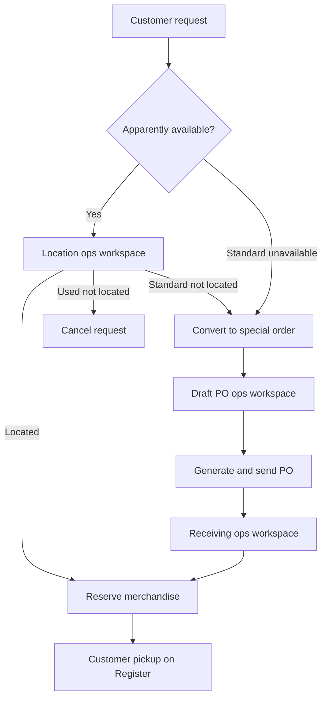

# Phase 7 — Orders and receiving workflows

## Status

Accepted companion to [phase7-spec.md](phase7-spec.md). Operator-facing flow narrative for Phase 7; the spec remains normative for data, locks, and acceptance.

**Authority:** [phase7-spec.md](phase7-spec.md) · [phase7-plan.md](phase7-plan.md) · [phase7-lock-order.md](phase7-lock-order.md)

---

Phase 7 contains three connected operational streams:

1. Customer requests and physical location
2. Supplier ordering
3. Receiving, reservation, and pickup

They converge when a Standard customer request requires supplier ordering.



**Document numbering (brief):** customer request and order numbers at creation; PO number at generate; purchase receipt number at posting (abandoned drafts do not consume receipt numbers).

Operator surfaces (see the Phase 7 spec §17):

* **Admin chrome** — suppliers, sources, customers, history, posted documents.
* **Purchasing ops workspaces** — location, draft PO, and receiving (Register-class dedicated layouts; Hotwire allowed). Ops chrome minimum: branding; store / document / user identity; exit to Purchasing; no silent draft loss; authz / flash / dialog / a11y.
* **POS Register workspace** — stays independent; Phase 7 extends it for pickup and reservation-aware sales. Do not fold POS into a shared purchasing ops shell in Phase 7.

## 1. Supplier and source setup

An administrator creates an active supplier in admin chrome.

For Standard variants, the administrator may also create an optional supplier source containing:

* supplier item number;
* list price and discount, or direct expected cost;
* organization-wide preferred status;
* optional store-specific preference.

Used variants cannot have supplier sources.

A source is helpful but not required. A buyer can select any active supplier and enter expected cost manually.

## 2. Create a stock order

A buyer begins from:

* the product or Standard variant page;
* the Orders area; or
* the open draft PO ops workspace.

The buyer selects:

* store;
* Standard variant;
* supplier;
* quantity;
* optional notes.

ShelfSense then atomically:

1. Creates the internal stock order (store-scoped **order number** assigned at creation).
2. Finds or creates the open draft PO for that supplier and store.
3. Creates a dedicated PO line for the order.
4. Defaults expected economics from the supplier source, when available.

Every order receives its own PO line, even when several lines contain the same variant. Line consolidation is deferred.

## 3. Create and route a customer request

Each Phase 7 request is for:

* one customer;
* one store;
* one exact variant;
* quantity one.

ShelfSense assigns a store-scoped **request number** at creation and checks apparent availability.

### Standard variant

* Available: place the request in the location ops workspace queue.
* Unavailable: automatically begin the special-order workflow (enabled in Slice 7.3).

### Used variant

* An unreserved on-hand unit exists: place the request in the location ops workspace queue.
* No unit is available: reject request creation.

Creating a location request does not reserve inventory. Staff must physically confirm the merchandise first.

## 4. Locate in-stock merchandise

The request appears in the store’s location ops workspace.

Staff searches for the physical item.

### Located Standard merchandise

Staff confirms one physical copy. ShelfSense creates a quantity allocation:

* on-hand remains unchanged;
* reserved increases by one;
* generally available quantity decreases by one;
* request becomes `available`.

### Located Used merchandise

Staff scans or selects the exact `inventory_unit`. ShelfSense allocates that unit:

* unit remains physically `on_hand`;
* ordinary sale or another request cannot use it;
* request becomes `available`.

ShelfSense rechecks availability when staff confirms the item. If another operation consumed the stock first, confirmation fails and staff must resolve the request as not located.

**Competing pending-location:** when two or more requests compete for the same last available Standard copy or Used unit, the **first successful locate wins** under [phase7-lock-order.md](phase7-lock-order.md). Later locates fail with a current-state explanation.

**Hard-stop:** from Slice 7.2 onward, ordinary POS sales and other stock-depleting paths hard-stop against `available` quantity and against allocated Used units. Reserved stock is not a soft warning. The allocation-linked pickup exception arrives only in Slice 7.6.

## 5. Resolve an item that cannot be located

Staff records that the item was not located, along with optional notes.

### Standard request

Staff chooses:

* convert to special order; or
* cancel request.

Conversion preserves the original customer request. ShelfSense requires or resolves a supplier, creates the internal order, assigns it to the supplier/store draft PO, and creates its dedicated line.

### Used request

The request must be cancelled. It cannot become a supplier order or waitlist.

Not-located merchandise does not automatically reduce inventory. Staff may open the inventory investigation or adjustment workflow separately.

## 6. Build and send a purchase order

Orders automatically accumulate on the open draft PO for their supplier and store.

In the draft PO ops workspace, the buyer reviews the keyboard-oriented line grid and may edit, before sending:

* order quantity;
* supplier;
* notes;
* expected line economics.

Changing supplier moves the order and line to the correct supplier/store draft PO.

The buyer then:

1. Resolves validation errors.
2. Generates the PO (**PO number** assigned at generate if absent).
3. Prints or downloads the supplier-facing document.
4. Sends it outside ShelfSense.
5. Records the transmission method and time.

Once sent, the PO and its line snapshots are immutable.

An unsent generated PO may return to draft if it has no supplier response, cancellation, or receiving activity. Its assigned number is retained and never reused.

## 7. Record supplier responses

Supplier acknowledgment is optional and is not required before receiving.

The buyer may record:

* confirmed quantity;
* backordered quantity;
* expected delivery date;
* supplier reference;
* notes.

Backordered quantity remains open.

The buyer can:

* wait for it;
* cancel it;
* cancel and re-source it.

### Re-sourcing

ShelfSense:

1. Records cancellation against the original line.
2. Reduces its open quantity immediately.
3. Creates a linked replacement order.
4. Requires a supplier for the replacement.
5. Adds the replacement to the appropriate draft PO.
6. Preserves the customer-request relationship when applicable.

The original submitted order and PO line are never rewritten.

## 8. Create and post a physical receipt

Each physical delivery receives its own purchase receipt in the receiving ops workspace.

The receiver selects:

* destination store;
* supplier;
* delivery date;
* optional supplier document number and date.

One receipt may contain lines from several POs when they all belong to that supplier and store.

Draft receipts use their UUID identity until posting. The store-scoped **receipt number** is assigned **at posting**; abandoned drafts do not consume numbers.

### Fast receiving flow

For each item:

1. Scan or search its identifier.
2. ShelfSense finds matching open PO lines.
3. Select the only match automatically, or show a keyboard-selectable list.
4. Default quantity to the open quantity.
5. Show expected PO cost as an editable starting value.
6. Receiver enters or confirms actual quantity and unit cost.
7. Add the line and restore scanner focus.

Used variants are excluded from receiving lookup.

### Over-shipment

When received quantity exceeds open quantity:

* the open quantity fulfills the order;
* excess becomes unplanned ordinary stock;
* submitted order quantity does not change.

### Receipt posting

Before posting, ShelfSense shows:

* matched units;
* unplanned units;
* customer-allocated units;
* merchandise value;
* freight;
* handling;
* supplier tax;
* miscellaneous charges;
* operational acquisition total;
* warnings.

Posting atomically:

* assigns the receipt number;
* freezes the receipt;
* posts inventory quantity;
* posts merchandise value using actual unit cost;
* updates order fulfillment;
* creates the customer allocation where applicable;
* updates PO/request status;
* records audit and outbox events.

Ancillary charges are recorded but do not enter inventory carrying value in Phase 7.

## 9. Receive a customer special order

When a Standard special-order receipt is posted:

* one matched copy is allocated to the active customer request;
* request becomes `available`;
* the copy is excluded from general availability;
* any over-shipped copy becomes ordinary stock.

If the customer request was cancelled before receipt, all received merchandise becomes ordinary stock.

## 10. Complete customer pickup

Pickup happens on the existing POS Register workspace—not in a purchasing ops workspace and not by marking the request completed in admin.

At the Register, staff searches available requests by:

* customer name;
* phone;
* request identifier / number;
* merchandise identifier.

The available allocation is linked to a POS line and added to the transaction.

* Standard request consumes the reserved quantity.
* Used request must use the exact allocated inventory unit.
* Normal POS price and tax rules apply.
* Estimated request price is informational only.

**Ordinary vs pickup capacity (Slice 7.6):** ordinary Standard capacity = `available`; pickup capacity = `available` + quantity allocated to that line. Ordinary Used sales cannot take an allocated unit; Used pickup must own that allocation. Until 7.6, ordinary hard-stop applies with no pickup exception.

Only successful transaction completion:

* marks the allocation fulfilled;
* posts the normal inventory sale;
* marks the customer request completed.

A cancelled or failed transaction leaves the request available. Phase 7 does not provide a manual “mark completed” path without that POS sale.

## 11. Cancel a customer request

Cancellation requires an actor and reason.

ShelfSense:

* releases any active allocation;
* returns located merchandise to general availability;
* does not automatically cancel a sent supplier order;
* treats later receipts for that request as ordinary stock.

An unsent related order requires an explicit buyer decision about whether to cancel it.

Automatic request expiration is deferred. `system_settings.default_customer_reservation_expiration_days` remains configuration-only in Phase 7.

## 12. Correct a posted receipt

Posted receipts cannot be edited.

### Quantity error

Reverse an eligible individual receipt line. Whole-receipt reversal is a convenience that creates all eligible line reversals atomically.

### Cost error

Post a valuation-only correction linked to the receipt line. Physical quantity does not change.

### Downstream activity prevents reversal

If the merchandise has already been picked up or sold and exact reversal is unsafe, ShelfSense blocks the reversal and requires an authorized compensating adjustment (`purchase_receipts.compensate`). The compensating path posts an inventory adjustment with a `compensating_adjustment_reference` correction; it never silently undoes a completed customer pickup. Without that authorization, the command fails with a message directing the operator to the compensate/adjustment path.

## 13. Automatic closure

For each sent PO line:

```text
open quantity =
  ordered quantity
  − posted matched receipts
  − recorded cancellations
  + eligible receipt reversals
```

Backordered quantity remains open.

When every line reaches zero open quantity, ShelfSense closes the PO automatically. Unplanned overage does not affect PO fulfillment.
