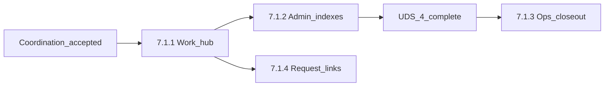

# Phase 7.1 — Purchasing workflow and presentation closeout

## Status

**7.1.1–7.1.2 on `main`** (PR #35). **UDS-4.1 and UDS-4.2 on `main`**. **7.1.3 ready for review** on branch `phase-7.1.3-purchasing-ops-closeout` (PR #40) — see [phase7.1.3-plan.md](phase7.1.3-plan.md). **7.1.4 deferred** unless separately opened. Phase 7.1 completes when 7.1.3 merges to `main`.

**Not** the inspirational Warm Parchment exploration in [docs/drafts/phase-7.1-ux-refactor/](../../drafts/phase-7.1-ux-refactor/README.md) (cross-phase UX notes; path retained for stability).

Authority: [Phase 7 packet](../phase7-orders-and-receiving/README.md), [phase7-spec.md](../phase7-orders-and-receiving/phase7-spec.md) §17, [UDS-4 plan](../ux-design-system/uds-4-plan.md).

## Goal

Close justified **operator ergonomics gaps** left when Phase 7 shipped core purchasing and customer-request behavior—without changing Phase 7 locked decisions (order↔PO line cardinality, availability formula, lock order, immutability).

## Deliverable

> Authorized purchasing workflows gain justified ergonomics improvements without reopening Phase 7 core contracts or deferring higher-priority forward phases.

Phase 7.1 closes **Phase 7 operability** before forward domains (stored value, buyback, customer expansion, bibliographic enrichment, register cash). UDS grouped navigation remains a parallel UDS program.

## What Phase 7 already provides

Phase 7 on `main` ships suppliers, quantity-one requests, locate/reserve, orders, draft/send POs, receiving, Register pickup, and receipt corrections. Product and variant show pages include operational panels and quick actions.

## Gaps this phase targets

| Gap | Spec reference | Slice |
|---|---|---|
| No purchasing work hub with active-work summaries | §17.1 | 7.1.1 ✓ |
| Bare admin orders/PO/receipt indexes | §17.1 navigation; migration matrix | 7.1.2 ✓ |
| Location/Draft PO ops interaction closeout | §17.3–17.4 | 7.1.3 (PR #40) |
| Request admin next-action polish (if hub insufficient) | §17.6 | 7.1.4 deferred |

## Explicitly out of scope

Same as [roadmap.md](../roadmap.md) and Phase 7 §4 deferrals:

- Supplier returns; request/reservation expiration automation
- PO line consolidation; multi-quantity customer requests
- Manager sell-through-reserve override
- AP, landed cost, replenishment automation, EDI
- Folding Register into ops shell; new permissions unless a new controlled operation appears
- Grouped admin navigation (UDS-4.1); new index filter/query behavior beyond existing PO status filter

**Evaluation rule:** each candidate slice must pass a contract-impact check (schema, lock order, availability, immutability) before inclusion.

## Locked decisions

1. **Coordination gate** — [phase7.1-uds-coordination.md](phase7.1-uds-coordination.md) is **Accepted** (August 2026).
2. **Phase 7 contracts unchanged** — one order ↔ one PO line; `available = on_hand - active_reserved - unavailable`; [phase7-lock-order.md](../phase7-orders-and-receiving/phase7-lock-order.md) binding.
3. **Shell boundaries** — admin chrome server-rendered without Hotwire; ops workspaces remain Register-class siblings of POS.
4. **Merge policy** — integration branch **`phase-7.1-purchasing-polish`** from `main`; slice branches PR into integration; merge **7.1.1–7.1.2** to `main` when ready. **7.1.3** ships later after UDS-4.1 (+ optional 7.1.4). Manual gate: no Phase 7 command or lock-order behavior changed.
   - **Supersedes decision 4 for 7.1.3+ (August 2026):** slice branch `phase-7.1.3-purchasing-ops-closeout` targets **`main` directly**; integration branch retired after 7.1.1–7.1.2 merged.
5. **UDS ownership** — nav chrome and non-purchasing adoption per coordination table; Phase 7.1 owns purchasing templates and hub queries.
6. **Hub section visibility** — omit sections the user is **not authorized** to see; **show authorized sections even when count is zero** with a compact clear state (not a full `empty_state` panel). Hub layout stays stable for an authorized user.
7. **No-store hub** — hub remains reachable when the user has any hub-eligible permission globally or on any accessible store; without `current_store`, show “Select a store to view purchasing work” and org-wide history links only; **no auto-redirect** away from the hub; no store-scoped counts without a store.
8. **Flat → grouped nav transition** — before UDS-4.1, add **Purchasing** hub link and keep existing Orders / PO / Receipt flat links; after UDS-4.1, **Purchasing** group primary entry = hub and entity links become children only (UDS-4.1 removes redundant top-level links).
9. **Sent PO count** — `sent` POs where at least one line has `open_quantity > 0` via relation-level SQL scope (`PurchaseOrder.sent.with_open_lines`); status remains `sent` during partial receipt until close per Phase 7 spec.
10. **Receipt drafts link** — primary section destination = receiving workspace index (`ops_receiving_index_path`), not “most recent draft.”
11. **7.1.2 filters** — presentation and cross-links only; preserve existing PO **`status`** filter; **no new** orders or receipts filter behavior in 7.1.2.
12. **Cross-links** — permission-, store-, and record-gated; helpers return `nil` when destination is unauthorized.
13. **Action buttons** — follow [button-action-semantics.md](../ux-design-system/button-action-semantics.md): at most one solid brand dominant action per hub section when count > 0; outline for secondary workspace entry; link/ghost for history; compact size for dense table-row actions.

### Hub-eligible permissions (minimum)

`customer_requests.locate`, `orders.view`, `orders.manage`, `purchase_receipts.view`, `purchase_receipts.manage` — aligned with hub sections and flat-nav **Purchasing** link visibility (any accessible store or global assignment).

## Slices

### Slice 7.1.1 — Purchasing work hub

**Status:** **Complete** on `main`.

**Coordination rows:** 1, 9, 10.

**Scope:**

- Admin hub at **`GET /admin/purchasing`** (`Admin::PurchasingController#show`)
- `Purchasing::WorkHubSummary` — authorized sections, SQL-backed counts, no-store vs store-scoped modes
- Summaries with deep links, minimum:
  - requests awaiting location → location ops (when `customer_requests.locate` + store)
  - open draft POs → draft PO ops index (when `orders.manage` + store)
  - sent POs with open quantity → sent PO admin filter (when `orders.view` + store)
  - receipt drafts in progress → `ops_receiving_index_path` (when `purchase_receipts.manage` + store)
  - history links (orders, POs, receipts) when authorized without requiring store scope where controllers already allow
- Read-only queries; no new domain commands

**Tests:** integration tests for full admin profile, narrow store-scoped profile, no-store hub, unauthorized direct URLs.

### Slice 7.1.2 — Admin purchasing history presentation

**Status:** **Complete** on `main`.

**Coordination rows:** 4, 7, 8.

**Scope:**

- Modernize [admin/orders](../../../app/views/admin/orders/index.html.erb), [admin/purchase_orders](../../../app/views/admin/purchase_orders/index.html.erb), and purchase receipt admin views
- Shared admin anatomy: `page_header`, breadcrumbs, `data_table`, existing filters only, empty states, `ActionButtonHelper`
- `PurchasingHelper` cross-links on show pages per [cross-link conventions](phase7.1-uds-coordination.md#cross-link-conventions) with authorization gating
- Explicit `.table-scroll` / `.data-table` on receipt surfaces; no global `table` selector on receipt detail

**Filter scope (locked):**

| Index | 7.1.2 behavior |
|---|---|
| Orders | Layout modernization only; no new filters |
| Purchase orders | Existing `status` param filter preserved |
| Receipts | Layout modernization only; index remains posted/reversed scope |

### Slice 7.1.3 — Purchasing ops interaction closeout

**Status:** **Ready for review** on branch `phase-7.1.3-purchasing-ops-closeout` (PR #40) — authoritative plan: [phase7.1.3-plan.md](phase7.1.3-plan.md).

**Note:** Hub exit links and light `ActionButtonHelper` / table-scroll touch-ups on Location, Draft PO, and Receiving templates shipped with **7.1.1** as incidental integration. Those changes do **not** satisfy 7.1.3 acceptance.

**Scope:**

- Close shared ops interaction contracts for Location and Draft PO (dirty abandonment, focus restoration, recoverable errors, contextual shortcuts, action presentation)
- Workspace-aware Escape precedence across shared Stimulus controllers
- Receiving is protected reference evidence only—no Receiving template changes
- Update program-plan allowlist and [phase7.1.3-ops-evidence.md](phase7.1.3-ops-evidence.md)
- Additive coverage in `purchasing_ops_workspace_test.rb` and `location_queue_buttons_test.rb`

### Slice 7.1.4 — Customer-request admin cross-links (optional)

**Status:** **Deferred** — hub covers active-work discovery; reopen only if request show/index purchasing deep links are still insufficient.

**Coordination row:** 5.

**Scope:** Only if justified—polish request index/show purchasing deep links.

## Engineering constraints

- Command services + audit + outbox + idempotency unchanged
- Inventory posting only through named services in [inventory-posting-contract.md](../phase3-inventory-foundation/inventory-posting-contract.md)
- Ops: Importmap + Turbo + Stimulus where already used; admin without Hotwire on chrome

## Acceptance criteria (phase complete)

1. Coordination doc Accepted.
2. Slices **7.1.1**, **7.1.2**, and **7.1.3** implemented on `main`; **7.1.4** explicitly deferred unless separately opened.
3. Staff can discover active purchasing work without hunting flat nav links.
4. No Phase 7 locked decisions or lock-order rows changed silently.
5. [roadmap.md](../roadmap.md) and docs index reflect Phase 7.1 status.

Documentation follow-up (program-plan allowlist, migration-matrix ownership) completed August 2026 per [phase7.1-uds-coordination.md](phase7.1-uds-coordination.md).

## User stories

See [phase7.1-user-stories.md](phase7.1-user-stories.md).
