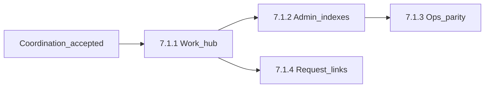

# Phase 7.1 — Purchasing polish

## Status

**Proposed.** Coordination **Accepted** ([phase7.1-uds-coordination.md](phase7.1-uds-coordination.md)); application slices may proceed.

Authority: [Phase 7 packet](../phase7-orders-and-receiving/README.md), [phase7-spec.md](../phase7-orders-and-receiving/phase7-spec.md) §17, [UDS-4 plan](../ux-design-system/uds-4-plan.md).

## Goal

Close justified **operator ergonomics gaps** left when Phase 7 shipped core purchasing and customer-request behavior—without changing Phase 7 locked decisions (order↔PO line cardinality, availability formula, lock order, immutability).

## Deliverable

> Authorized purchasing workflows gain justified ergonomics improvements without reopening Phase 7 core contracts or deferring higher-priority forward phases.

## What Phase 7 already provides

Phase 7 on `main` ships suppliers, quantity-one requests, locate/reserve, orders, draft/send POs, receiving, Register pickup, and receipt corrections. Product and variant show pages include operational panels and quick actions.

## Gaps this phase targets

| Gap | Spec reference | Slice |
|---|---|---|
| No purchasing work hub with active-work summaries | §17.1 | 7.1.1 |
| Bare admin orders/PO/receipt indexes | §17.1 navigation; migration matrix | 7.1.2 |
| Location/Draft PO ops below Receiving parity | §17.3–17.5; optional shared Stimulus | 7.1.3 |
| Request admin next-action polish (if hub insufficient) | §17.6 | 7.1.4 optional |

## Explicitly out of scope

Same as [roadmap.md](../roadmap.md) and Phase 7 §4 deferrals:

- Supplier returns; request/reservation expiration automation
- PO line consolidation; multi-quantity customer requests
- Manager sell-through-reserve override
- AP, landed cost, replenishment automation, EDI
- Folding Register into ops shell; new permissions unless a new controlled operation appears

**Evaluation rule:** each candidate slice must pass a contract-impact check (schema, lock order, availability, immutability) before inclusion.

## Locked decisions

1. **Coordination gate** — [phase7.1-uds-coordination.md](phase7.1-uds-coordination.md) is **Accepted** (August 2026).
2. **Phase 7 contracts unchanged** — one order ↔ one PO line; `available = on_hand - active_reserved - unavailable`; [phase7-lock-order.md](../phase7-orders-and-receiving/phase7-lock-order.md) binding.
3. **Shell boundaries** — admin chrome server-rendered without Hotwire; ops workspaces remain Register-class siblings of POS.
4. **Merge policy** — slices merge independently to `main` (Phase 6.1 style); no integration branch.
5. **UDS ownership** — nav chrome and non-purchasing adoption per coordination table; Phase 7.1 owns purchasing templates and hub queries.

## Slices

### Slice 7.1.1 — Purchasing work hub

**Coordination rows:** 1, 9, 10.

**Scope (proposed):**

- Store-scoped admin hub at **`GET /admin/purchasing`** (`Admin::PurchasingController#show`)
- Permission-filtered sections; omit empty sections
- Summaries with deep links, minimum:
  - requests awaiting location → location ops
  - open draft POs → draft PO ops index
  - sent POs with open quantity → PO admin filter
  - receipt drafts in progress → receiving ops
  - queryable exceptions where data exists (e.g. validation-blocked drafts)
- Read-only queries; no new domain commands unless a dedicated query object is justified

**Tests:** integration tests for at least one full admin profile and one narrow store-scoped profile.

### Slice 7.1.2 — Admin purchasing history presentation

**Coordination rows:** 4, 7, 8.

**Scope:**

- Modernize [admin/orders](../../../app/views/admin/orders/index.html.erb), [admin/purchase_orders](../../../app/views/admin/purchase_orders/index.html.erb), and purchase receipt admin views
- Shared admin anatomy: `page_header`, breadcrumbs, `data_table`, filters, empty states, `ActionButtonHelper`
- Cross-links per coordination [Cross-link conventions](phase7.1-uds-coordination.md#cross-link-conventions)
- Preserve immutable posted-fact presentation; do not apply global `table` selectors to receipt detail without explicit class

### Slice 7.1.3 — Ops workspace parity (Location + Draft PO)

**Coordination row:** 6.

**Scope:**

- Align Location and Draft PO with Receiving: shortcut help, focus restoration, dirty-form guard, error partials
- Extract shared Stimulus only where behavior is identical
- Update program-plan allowlist in same PR
- No keyboard binding changes without updating frozen system tests

### Slice 7.1.4 — Customer-request admin cross-links (optional)

**Coordination row:** 5.

**Scope:** Only if 7.1.1 hub does not subsume index next-actions—polish request index/show purchasing deep links.

## Engineering constraints

- Command services + audit + outbox + idempotency unchanged
- Inventory posting only through named services in [inventory-posting-contract.md](../phase3-inventory-foundation/inventory-posting-contract.md)
- Ops: Importmap + Turbo + Stimulus where already used; admin without Hotwire on chrome

## Acceptance criteria (phase complete)

1. Coordination doc Accepted.
2. Slices **7.1.1** and **7.1.2** implemented; **7.1.3** per coordination row 6; **7.1.4** only if justified.
3. Staff can discover active purchasing work without hunting flat nav links.
4. No Phase 7 locked decisions or lock-order rows changed silently.
5. [roadmap.md](../roadmap.md) and docs index reflect Phase 7.1 status.

Documentation follow-up (program-plan allowlist, migration-matrix ownership) completed August 2026 per [phase7.1-uds-coordination.md](phase7.1-uds-coordination.md).

## User stories

See [phase7.1-user-stories.md](phase7.1-user-stories.md).
