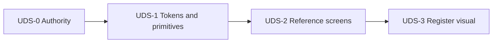

# UX design system — program plan

Status: **Proposed**

## Goal

Converge ShelfSense screens on one design vocabulary (Warm Parchment tokens + button/action semantics) without rewriting product architecture or collapsing admin, purchasing ops, and Register into a single shell.

## Program slices

Slices are labeled **UDS-*** (UX Design System) so they are not confused with Phase 7 domain slices 7.1–7.7.

### UDS-0 — UX authority and inventory

Documentation and inventory only:

- Inventory shells, partials, button classes, table patterns, forms, dialogs, and one-off markup in [migration-matrix.md](migration-matrix.md).
- Classify inconsistencies as: theme-only; missing shared primitive; misuse of an existing primitive; interaction redesign; domain presentation problem.
- Keep this packet and [ux-conventions.md](../../ux-conventions.md) aligned on status (Proposed vs Implemented).
- Label every mockup: inspirational, proposed, accepted, or implemented.
- Record conflicts with Phase 2.2 palette and resolve via [ADR-022](../../adr/ADR-022-warm-parchment-visual-tokens.md).

**Deliverable:** accepted planning authority; path-level inventory in [migration-matrix.md](migration-matrix.md) sufficient to start UDS-1.

### UDS-1 — Tokens and shared visual primitives

High-leverage, low-behavior changes:

- Warm Parchment canvas, surface, text, border, semantic, and interaction tokens ([warm-parchment.md](warm-parchment.md)).
- Controlled migration / aliases so existing components update consistently.
- Typography hierarchy using **locally packaged or system fonts** (no runtime Google Fonts dependency).
- Tabular numerals and identifier treatments.
- Button matrix per [button-action-semantics.md](button-action-semantics.md) (prefer a helper over free-form class lists).
- Map legacy `btn--secondary` → outline/neutral; preserve `btn--ghost` / danger semantics during migration.
- Solid modal surfaces; consequence dialog headers/footers; focus restoration unchanged.
- Tables, definition lists, cards, forms, validation, flashes, badges, empty states, focus rings.
- Standard and compact **density classes by screen type**—not a persisted user toggle.

**Deliverable:** many screens improve without rewriting each template; conventions palette section updated when tokens ship.

### UDS-2 — Representative screen convergence

Migrate a small reference set:

1. One administrative CRUD resource (e.g. Suppliers).
2. One data-heavy purchasing workspace (Receiving or Draft PO).
3. Transaction history/show (receipt summary presentation per [surface-contracts.md](surface-contracts.md)).
4. Existing consequential-action review dialogs.

For transaction/receipt detail:

- Preserve existing totals and historical contracts.
- Separate Sales / Returns / Net / Tenders only when supported by stored facts.
- Explicit **Line details** disclosures (not “audit logs”).
- Keep return/post-void eligibility server-authoritative.
- Leave printed receipt markup unchanged unless separately specified.

**Deliverable:** reference surfaces conforming; [migration-matrix.md](migration-matrix.md) updated.

### UDS-3 — Register visual refinement

Separate implementation slice:

- Two-level basket hierarchy; printed receipt stays one-line.
- Functional shortcut **visual** grouping (bindings unchanged).
- Clear selected-line styling; consistent totals and feedback.
- Improved overlay/modal separation.
- Preserve shortcuts, scanning, focus restoration, controlled-action flows, and minimum workstation layout.
- No global search or master-detail drawers.

Validate with timed/manual cashier workflows, not visual review alone.

**Deliverable:** Register uses revised patterns without behavior regressions.

## After the foundation program

- When a feature phase touches a screen, migrate that screen to accepted primitives.
- Give each phase explicit “UX adoption targets” citing this packet.
- Avoid opportunistic global redesign inside domain PRs.
- Keep [migration-matrix.md](migration-matrix.md) current.
- New interaction patterns in [deferred-patterns.md](deferred-patterns.md) require their own specifications.

## Explicitly deferred

See [deferred-patterns.md](deferred-patterns.md). Summary: universal master-detail drawers, global Cmd/Ctrl+K search, persisted density preference, collapsible global sidebar, Enter-on-row expand as default grid behavior, replacing admin show pages with drawers, fetching `audit_events` for every line, and broad conversion of all screens in one PR.

## Acceptance criteria (foundation program)

The UDS foundation (UDS-0 through UDS-3) is complete when:

1. Warm Parchment tokens are documented and consistently used on migrated components.
2. Existing one-off hex colors are removed from migrated components.
3. Admin, operations, and Register remain distinct shells using the same token vocabulary.
4. Primary, secondary, danger, warning, and informational actions are distinguishable without color alone ([button-action-semantics.md](button-action-semantics.md)).
5. Existing native review dialogs have opaque, clearly separated surfaces and correct focus behavior.
6. Supplier administration (or chosen admin reference), one purchasing workspace, transaction detail, and the Register use the revised patterns.
7. The Register retains existing shortcuts, scanner flow, command semantics, and focus restoration.
8. Printed receipt behavior—including its one-line description contract—is unchanged unless separately specified.
9. Transaction history displays historical snapshots and does not depend on current mutable merchandise values.
10. Keyboard-only and contrast checks pass a documented manual test gate (WCAG **AA** for ordinary interface text).
11. Existing authorization, command-service, audit, idempotency, and append-only behavior is unchanged.
12. Remaining legacy screens are listed in [migration-matrix.md](migration-matrix.md) rather than silently declared complete.
