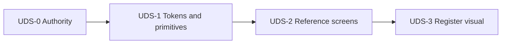

# UX design system — program plan

Status: **Proposed**

## Goal

Converge ShelfSense screens on one design vocabulary (Warm Parchment tokens + button/action semantics) without rewriting product architecture or collapsing admin, purchasing ops, and Register into a single shell.

## Program slices

Slices are labeled **UDS-*** (UX Design System) so they are not confused with Phase 7 domain slices 7.1–7.7.

## Implementation rollout contract

This section is the change-control contract for every UDS pull request. A slice may change only the files and selectors listed for that slice. Expanding the allowlist requires updating this plan in a preceding or same-commit documentation change and calling the expansion out in review; “shared CSS cleanup” is not implicit scope.

Objective migration states, the alias retirement register, and evidence columns live in [migration-matrix.md](migration-matrix.md). Reference-surface accessibility and timed cashier evidence remain governed by [accessibility-ergonomic-test-matrix.md](accessibility-ergonomic-test-matrix.md) (foundation criterion 10); the viewport/browser gates below do not replace that matrix.

### Objective migration states

- **Partial** means the surface uses at least one accepted token or primitive, but one or more required action semantics, component states (default, hover, active, focus-visible, disabled, validation, empty, loading where present), responsive checks, accessibility checks, or workflow regression checks are incomplete or failing. The matrix must name the missing requirement; inheriting new colors is partial at most.
- **Conforming** means all markup on the surface uses accepted primitives or an explicitly documented exception; action labels, intent, prominence, and review stages match [button-action-semantics.md](button-action-semantics.md); every applicable component state is visibly distinguishable; the viewport matrix below has no overlap, clipping, or unreachable action; keyboard order, visible focus, dialog focus restoration, labels/names, landmarks, and WCAG AA contrast have been checked; listed workflow tests and manual workflow gates pass; and for UDS-2/UDS-3 reference surfaces, the applicable rows of the [accessibility and ergonomic test matrix](accessibility-ergonomic-test-matrix.md) have attached evidence. Evidence (commit/PR, observation or screenshot identifier, viewport, and reviewers) must be linked from the matrix. A surface cannot become conforming solely through inherited colors.

### Slice change allowlist

| Slice | Shared selectors allowed to change | Helpers / partials / layouts allowed to change | Reference views allowed to change |
|---|---|---|---|
| UDS-0 | None | None | None; documentation and baseline capture only |
| UDS-1 | `:root`; base `body`, `a`, and the existing `:focus-visible` control list; `.app-shell`, `.app-header`, `.app-brand`, `.app-header-meta`, `.app-content`; `.ops-header`, `.ops-content`, `.ops-shortcuts`, `.ops-shortcuts__buttons`, `.ops-shortcuts__help`, `.ops-empty-state`; `.btn`, `.button`, `button`, `input[type="submit"]`, `.btn--secondary`, `.button-secondary`, `.btn--danger`, `.button-danger`, `.btn--ghost`; new `btn--solid` / `btn--outline` / `btn--link` / `btn--brand` / `btn--neutral` / `btn--warning` / size classes from the action matrix; `.flash`, `.flash--notice`, `.flash--alert`; `.status-badge` and existing status modifiers; `.muted`, `.missing-value`, `.definition-list`, `.section`, `.section__title`, `.section__help`, `.form`, `.form-field`, `.form-errors`, `.table-scroll`, `.data-table`, `.empty-state`, `.empty-state__title`, `.technical-details`, `.pagination`, `.filters`; `.review-dialog` and existing severity/body/facts/consequences/actions variants; new token/primitive selectors named individually in the PR. **Grouped navigation selectors** (e.g. `.app-nav`, `.app-nav-group`) only after the [navigation prototype gate](navigation-proposal.md#required-prototype-gate) passes and this allowlist is updated to name them. | `app/helpers/application_helper.rb` (including `ActionButtonHelper` when introduced); `app/views/shared/_actions.html.erb`, `_breadcrumbs.html.erb`, `_currency_field.html.erb`, `_data_table.html.erb`, `_definition_list.html.erb`, `_empty_state.html.erb`, `_flash.html.erb`, `_form_errors.html.erb`, `_form_section.html.erb`, `_page_header.html.erb`, `_status_badge.html.erb`, `_technical_details.html.erb`; `app/views/layouts/application.html.erb`, `app/views/layouts/ops.html.erb` (token/chrome only; **no** grouped-nav IA change until the navigation prototype gate) | None except a minimal fixture/use-site change needed to exercise a shared primitive; name it in the PR |
| UDS-2 | UDS-1 primitives plus `.request-next-action`, `.request-summary__heading`, `.fulfillment-timeline*`, `.ops-queue` (as used by Receiving), `.pos-history*`, `.pos-receipt__actions`, `.review-dialog` variants listed in UDS-1, and new selectors named individually and scoped to an allowlisted reference view | UDS-1 shared partials; `app/helpers/purchasing_helper.rb`, `app/helpers/pos_helper.rb`; `app/views/ops/shared/_error_summary.html.erb`, `_inline_row_error.html.erb`; `app/views/pos/receipts/_directional_totals.html.erb`, `_post_void_banner.html.erb`; layouts may be consumed but not structurally changed | `app/views/admin/suppliers/{index,show,new,edit,_form}.html.erb`; **Receiving only:** `app/views/ops/receiving/{index,show,review,_line_grid,_line_scanner}.html.erb` (Location and Draft PO are post-UDS-2); `app/views/pos/completed_transactions/show.html.erb`; existing consequence-dialog markup within those views |
| UDS-3 | `.pos-body`, `.pos-shell`, `.pos-header*`, `.pos-main`, `.pos-basket`, `.pos-lines`, `.pos-line-flags`, `.pos-totals*`, `.pos-feedback`, `.pos-actions`, `.pos-command*`, `.pos-picker`, `.pos-banner`, `.pos-overlay*`, `.pos-hidden`; UDS-1 `.review-dialog` and button/token primitives only when a Register state exposes a defect; new Register selectors named individually in the PR | `app/helpers/pos_helper.rb`; `app/views/layouts/pos.html.erb`; `app/views/pos/transactions/_chrome.html.erb`, `_line.html.erb`; `app/views/pos/workspaces/_surface.html.erb` | `app/views/pos/workspaces/show.html.erb` and Turbo stream replacements for that workspace; no printed receipt view or print selector |

Across all slices, `app/views/pos/receipts/_print.html.erb`, `.pos-receipt__print*`, service/controller/domain code, Stimulus key bindings, Turbo target IDs, form actions/methods, and authorization conditions are locked. A needed change to one of these is a separate behavior slice, not incidental UDS work.

### Baseline evidence and browser/viewport gate

UDS-0 records either committed screenshots or the following reproducible structured observation for each shell before implementation. Evidence uses seeded deterministic data, browser zoom 100%, no extensions, and records the route, commit, Chromium version, viewport, and state (normal plus validation/dialog/empty state as applicable).

| Shell / baseline route | Representative baseline observation | Required viewport checks |
|---|---|---|
| Admin — `/admin/suppliers` plus new/edit | Phase 2.2 white surface on blue-gray canvas; teal primary and plum secondary actions; wrapping global navigation; horizontally scrolling data table; stacked labeled form errors | Chromium at 390×844, 768×1024, and 1440×900 |
| Operations — `/ops/receiving` (selected reference) | Separate ops header, sticky shortcut strip, compact grid/row errors, keyboard-first primary action; table may scroll rather than compress | Chromium at 1280×720 (supported minimum) and 1440×900 |
| History — `/pos/completed_transactions/:id` | Screen receipt/history chrome and action group are distinct from fixed-width print markup; historical totals and post-void/return affordances depend on stored state | Chromium at 1280×720 and 1440×900; print preview at the existing receipt paper target |
| Register — active `/pos/workspace` | Fixed minimum 1280-wide cashier shell; basket, selected line, totals, feedback and modal overlays compete within 720px height; scan field regains focus | Chromium at 1280×720 (release gate) and 1440×900 |

Chromium is the automated and supported browser for this program's visual/regression baselines. Responsive admin checks below 1280 do not imply that the ops or Register workstation shells support a phone viewport. The [accessibility and ergonomic test matrix](accessibility-ergonomic-test-matrix.md) additionally requires Firefox, 320×568, 200%/400% zoom, assistive-technology, forced-colors, and timed Register evidence for foundation completion—do not treat the table above as a substitute.

**Read order for implementers:** (1) satisfy this section’s Chromium baselines and frozen suites on every UDS PR; (2) for reference-surface **conforming** status and foundation criterion 10, also complete the applicable rows of the [accessibility and ergonomic test matrix](accessibility-ergonomic-test-matrix.md).

At each required viewport above, manually check initial, hover, focus-visible, active, disabled, error, empty, long-label/long-identifier, and open dialog states when the surface contains them. Store screenshots outside the repo as PR artifacts unless the slice explicitly adds a small, approved baseline fixture.

### Behavior and indirect-impact gates

The following behavior suites are frozen expectations: a UDS change may add visual or accessibility assertions, but must not delete, relax, rename, or rewrite existing workflow assertions to make the slice pass.

| Slice | Behavioral tests that must remain unchanged and pass | Manual checks for indirect shared-CSS impact |
|---|---|---|
| UDS-1 | `test/helpers/application_helper_test.rb`; `test/integration/suppliers_admin_test.rb`; `test/integration/purchasing_ops_layout_test.rb`; `test/integration/pos_register_test.rb`; `test/integration/pos_transaction_history_test.rb`; all existing `test/system/` tests | Sign-in/store selection; one non-reference admin index/show/form with errors and empty state; inventory adjustment confirmation; ops shortcut help and inline error; completed transaction and post-void review; Register workspace; customer receipt print preview |
| UDS-2 | UDS-1 list plus `test/integration/receiving_line_lookup_test.rb`, `test/integration/purchase_orders_admin_test.rb`, `test/system/purchasing_ops_workspace_test.rb`, and `test/system/location_queue_buttons_test.rb` | Products and Stores CRUD; customer request consequence dialog; location queue; Draft PO (not the UDS-2 reference); Register sale/return; printed receipt compared with its locked one-line contract |
| UDS-3 | UDS-1 list plus `test/system/pos_register_workspace_test.rb`, `test/system/pos_linked_return_test.rb`, `test/system/pos_unlinked_return_test.rb`, `test/system/pos_mixed_return_test.rb`, `test/system/pos_close_z_test.rb`, and `test/system/store_receipt_messages_test.rb` | Admin supplier form and data table; ops receiving grid and shortcut strip; transaction history/reprint; opening, sale, controlled price action, linked and unlinked return, mixed tender, cancel, close, and focus restoration using keyboard/scanner flow; receipt print preview |

The slice PR records each manual result, viewport, and reviewer. Any indirectly affected surface that fails returns to `partial`, even if its own templates did not change.

### Review ownership

No person is permanently named in this proposed packet; ownership is enforced as three independent review disciplines, with the reviewer identity recorded in the PR. Map these to evidence IDs in the [accessibility and ergonomic test matrix](accessibility-ergonomic-test-matrix.md) when that gate applies (`K`/`SR`/`D`/`C` → accessibility; `I`/`E` and timed scenarios → domain-workflow; `R`/`S`/`T`/`M` → visual-consistency / UX, with accessibility co-sign where specified).

- **Accessibility reviewer:** keyboard-only traversal, focus visibility/order and restoration, native dialog behavior, accessible names/labels, landmarks, zoom, non-color cues, measured WCAG AA contrast, and (for reference surfaces) the matrix evidence they own. This reviewer must not be the implementing author.
- **Domain-workflow reviewer:** an owner familiar with the affected admin, purchasing, or POS contract executes the manual workflow and confirms action wording/severity, authorization visibility, historical facts, shortcuts, scanning, totals, print behavior, and timed cashier scenarios remain correct.
- **Visual-consistency reviewer:** the UDS maintainer (or a reviewer applying this packet) compares all shell baselines at matched viewport/state and checks tokens, hierarchy, density, component states, and cross-shell consistency. This reviewer may also fill one of the other roles only when the PR records both checklists.

### Token rollback

UDS-1 lands token values and alias mappings in a dedicated commit, separate from reference-view markup. Before merge, preserve the prior `:root` values as a named `legacy-phase-2-2` mapping in the PR description (not as a second live theme). If shared tokens cause widespread regressions: (1) stop later UDS slices, (2) revert the token/alias commit as a unit, (3) retain safe view-local migrations only if they pass against the restored tokens, (4) return affected matrix entries and aliases to their previous status, and (5) open a focused correction with before/after evidence across all four shell baselines. Do not patch regressions with scattered one-off hex values, `!important`, or silent alias reinterpretation.

### UDS-0 — UX authority and inventory

Documentation and inventory only:

- Inventory shells, partials, button classes, table patterns, forms, dialogs, and one-off markup in [migration-matrix.md](migration-matrix.md).
- Inventory the flat permission-gated application navigation and validate canonical task/domain groups per [navigation-proposal.md](navigation-proposal.md).
- Classify inconsistencies as: theme-only; missing shared primitive; misuse of an existing primitive; interaction redesign; domain presentation problem.
- Keep this packet and [ux-conventions.md](../../ux-conventions.md) aligned on status (Proposed vs Implemented).
- Label every mockup: inspirational, proposed, accepted, or implemented.
- Record conflicts with Phase 2.2 palette and resolve via [ADR-022](../../adr/ADR-022-warm-parchment-visual-tokens.md).

**Deliverable:** accepted planning authority; path-level inventory in [migration-matrix.md](migration-matrix.md) sufficient to start UDS-1.

Administrative navigation remains a proposal at this point. Before assigning it to UDS-1 or UDS-2, pass the proposal's prototype gate with a fully privileged administrator and a narrowly scoped store user, including permission/current-store filtering, one-destination groups, active state, keyboard/screen-reader operation, JavaScript-disabled use, and narrow-width/high-zoom reflow.

### UDS-1 — Tokens and shared visual primitives

**Implementation plan:** [uds-1-plan.md](uds-1-plan.md) (sub-slices UDS-1a–1d; backlog [uds-1-user-stories.md](uds-1-user-stories.md)). Slice id stays **UDS-1**—not a Phase 7 domain number. Start gate: [ADR-022](../../adr/ADR-022-warm-parchment-visual-tokens.md) must be **Accepted** before token supersession merges to `main`.

High-leverage, low-behavior changes:

- Warm Parchment canvas, surface, text, border, semantic, and interaction tokens ([warm-parchment.md](warm-parchment.md)).
- Controlled migration / aliases so existing components update consistently.
- Typography hierarchy using **locally packaged or system fonts** (no runtime Google Fonts dependency). Face packaging / stack choice is owned by **UDS-1c** (see [uds-1-plan.md](uds-1-plan.md)); not UDS-1a/1b.
- Tabular numerals and identifier treatments.
- Button matrix per [button-action-semantics.md](button-action-semantics.md) via `ActionButtonHelper` (`action_link_to` / `action_button_to` / `action_submit` / `action_button`); no free-form class lists for new work.
- Map legacy `btn--secondary` → outline/neutral; preserve `btn--ghost` (style) and `btn--danger` (intent) tokens during the documented alias → deprecation sequence.
- Solid modal surfaces; consequence dialog headers/footers; focus restoration unchanged.
- Tables, definition lists, cards, forms, validation, flashes, badges, empty states, focus rings.
- Standard and compact **density classes by screen type**—not a persisted user toggle.
- Navigation may enter this slice as a shared semantic/responsive primitive only after the [navigation prototype gate](navigation-proposal.md#required-prototype-gate) passes; no Hotwire, permanent sidebar, or global search. Grouped admin nav remains **out of UDS-1** until that gate passes (see implementation plan).

**Deliverable:** many screens improve without rewriting each template; conventions palette section updated when tokens ship.

### UDS-2 — Representative screen convergence

Migrate a small reference set:

1. One administrative CRUD resource (e.g. Suppliers).
2. One data-heavy purchasing workspace (**Receiving** — the accessibility/ergonomic gate reference; Draft PO may still adopt patterns later).
3. Transaction history/show (receipt summary presentation per [surface-contracts.md](surface-contracts.md)).
4. Existing consequential-action review dialogs.

For transaction/receipt detail:

- Preserve existing totals and historical contracts.
- Separate Sales / Returns / Net / Tenders only when supported by stored facts.
- Explicit **Line details** disclosures (not “audit logs”).
- Keep return/post-void eligibility server-authoritative.
- Leave printed receipt markup unchanged unless separately specified.

**Deliverable:** reference surfaces conforming; [migration-matrix.md](migration-matrix.md) updated.

### UDS-3 — Register visual refinement

Separate implementation slice:

- Two-level basket hierarchy; printed receipt stays one-line.
- Functional shortcut **visual** grouping (bindings unchanged).
- Clear selected-line styling; consistent totals and feedback.
- Improved overlay/modal separation.
- Preserve shortcuts, scanning, focus restoration, controlled-action flows, and minimum workstation layout.
- No global search or master-detail drawers.

Validate with the [accessibility and ergonomic test matrix](accessibility-ergonomic-test-matrix.md), including timed cashier workflows—not visual review alone.

**Deliverable:** Register uses revised patterns without behavior regressions.

## After the foundation program

- When a feature phase touches a screen, migrate that screen to accepted primitives.
- Give each phase explicit “UX adoption targets” citing this packet.
- Avoid opportunistic global redesign inside domain PRs.
- Keep [migration-matrix.md](migration-matrix.md) current.
- New interaction patterns in [deferred-patterns.md](deferred-patterns.md) require their own specifications.

## Explicitly deferred

See [deferred-patterns.md](deferred-patterns.md). Summary: universal master-detail drawers, global Cmd/Ctrl+K search, persisted density preference, collapsible global sidebar, Enter-on-row expand as default grid behavior, replacing admin show pages with drawers, fetching `audit_events` for every line, and broad conversion of all screens in one PR.

## Acceptance criteria (foundation program)

The UDS foundation (UDS-0 through UDS-3) is complete when:

1. Warm Parchment tokens are documented and consistently used on migrated components.
2. Existing one-off hex colors are removed from migrated components.
3. Admin, operations, and Register remain distinct shells using the same token vocabulary.
4. Primary, secondary, danger, warning, and informational feedback (badges/flashes) plus button intents (brand / neutral / warning / danger) are distinguishable without color alone ([button-action-semantics.md](button-action-semantics.md), [warm-parchment.md](warm-parchment.md)).
5. Existing native review dialogs have opaque, clearly separated surfaces and correct focus behavior.
6. Supplier administration (or chosen admin reference), one purchasing workspace, transaction detail, and the Register use the revised patterns.
7. The Register retains existing shortcuts, scanner flow, command semantics, and focus restoration.
8. Printed receipt behavior—including its one-line description contract—is unchanged unless separately specified.
9. Transaction history displays historical snapshots and does not depend on current mutable merchandise values.
10. Supplier administration, the selected **Receiving** workspace, transaction history/detail, review dialogs, and Register pass the documented [accessibility and ergonomic test matrix](accessibility-ergonomic-test-matrix.md), including keyboard, assistive-technology, dialog, reflow, input-equivalence, resilient-state, and timed cashier workflow evidence (WCAG **AA** for ordinary interface text).
11. Existing authorization, command-service, audit, idempotency, and append-only behavior is unchanged.
12. Remaining legacy screens are listed in [migration-matrix.md](migration-matrix.md) rather than silently declared complete.
13. If grouped administrative navigation is included, both required permission profiles pass its documented prototype gate and no destination depends on pointer interaction or JavaScript.
