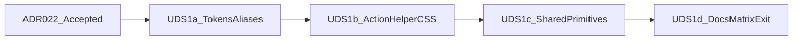

# UDS-1 — Tokens and shared visual primitives

Status: **Implemented** (UDS-1a–1d landed; ADR-022 Implemented; Chromium/indirect/a11y gates pending before matrix **conforming**)

Slice id remains **UDS-1**. This is **not** a Phase 7 domain slice and does not use Phase N.M numbering. Authority for visual tokens, actions, rollout gates, and deferrals remains the [UX design system packet](README.md).

Companion backlog: [uds-1-user-stories.md](uds-1-user-stories.md).

## Purpose

Ship Warm Parchment tokens and shared visual primitives so existing admin, purchasing-ops, and Register shells inherit one design vocabulary without rewriting domain behavior or migrating reference screens (that is [UDS-2](program-plan.md#uds-2--representative-screen-convergence)).

## Deliverable

> An authorized user sees Warm Parchment canvas, surfaces, text, borders, semantic feedback, and action styling across shared chrome via Propshaft CSS and helpers; Phase 2.2 teal/plum is temporarily aliased then superseded for screen chrome; printed receipt/report contracts and domain authorization, audit, and Register bindings are unchanged.

## Prerequisites (start gates)

1. UDS-0 path-level inventory is present in [migration-matrix.md](migration-matrix.md) (done).
2. **[ADR-022](../../adr/ADR-022-warm-parchment-visual-tokens.md) is Accepted** (done at UDS-1 kickoff) before token-supersession merges to `main`.
3. Follow the [implementation rollout contract](program-plan.md#implementation-rollout-contract): Chromium baselines, frozen test suites, review ownership, and [token rollback](program-plan.md#token-rollback).
4. **Grouped administrative navigation is out of UDS-1** until the [navigation prototype gate](navigation-proposal.md#required-prototype-gate) passes. Do not expand the allowlist for `.app-nav` / `.app-nav-group` in this slice.

## Locked decisions

Cite packet authority; do not invent local alternatives.

1. **Tokens** — Contrast-complete [warm-parchment.md](warm-parchment.md): brand default `#A84320`, semantic families, focus ring, dialog scrim, AA ledger. No blanket AAA claim.
2. **Actions** — [button-action-semantics.md](button-action-semantics.md): `ActionButtonHelper` with `action_link_to`, `action_button_to`, `action_submit`, `action_button`; style/intent allowlist; no label-inferred danger/warning; helper never injects `confirm()` or review dialogs.
3. **Aliases** — [Legacy alias retirement register](migration-matrix.md#legacy-alias-retirement-register); no silent reinterpretation of legacy `--color-*` or button shorthand.
4. **Shells** — Admin, ops, and Register remain distinct; no Hotwire on admin chrome; no permanent sidebar or Cmd/Ctrl+K ([deferred-patterns.md](deferred-patterns.md)).
5. **Locked surfaces** — Print selectors (`.pos-receipt__print*`, report print), Stimulus key bindings, Turbo target IDs, form methods, and authorization conditions are not incidental UDS work ([program-plan allowlist](program-plan.md#slice-change-allowlist)).
6. **Fonts** — System UI stack and/or locally packaged faces only (e.g. keep/extend Source Sans 3; existing receipt Inconsolata). No runtime Google Fonts or other CDN fonts. **Face packaging / stack decision is UDS-1c** (not UDS-1a color tokens or UDS-1b helper/CSS).
7. **Density** — Contextual CSS classes by screen type only; no persisted user density preference.
8. **Change allowlist** — UDS-1 may change only selectors/helpers/partials/layouts listed for UDS-1 in the [slice change allowlist](program-plan.md#slice-change-allowlist). Expanding the allowlist requires a same-commit docs update.

## Delivery sub-slices

Prefer one PR (or tightly sequenced PRs) per sub-slice. UDS-1a must land tokens/aliases in a **dedicated commit** separable for rollback.

### UDS-1a — Tokens and aliases

**Status: done** (Warm Parchment `:root` tokens + Phase 2.2 aliases in `application.css`; `legacy-phase-2-2` prior values recorded in the stylesheet comment).

- Expand `:root` in `app/assets/stylesheets/application.css` with Warm Parchment custom properties from [warm-parchment.md](warm-parchment.md).
- Keep legacy `--color-background`, `--color-surface`, `--color-text`, `--color-text-muted`, `--color-action`, `--color-accent`, `--color-warning`, `--color-border`, and `--color-danger` as temporary aliases to the documented destinations (or explicit non-aliases where the packet forbids catch-all mapping).
- Record prior Phase 2.2 `:root` values as `legacy-phase-2-2` in the PR description / stylesheet comment (not a second live theme).
- No reference-view markup rewrites; no print selector edits.

### UDS-1b — ActionButtonHelper and button CSS matrix

**Status: done** (`ActionButtonHelper` + unit tests; button CSS matrix and legacy compatibility selectors; no broad template adoption).

- Add `ActionButtonHelper` (prefer `app/helpers/action_button_helper.rb`, included from `ApplicationHelper`, matching existing helper layout).
- Emit exactly `btn btn--STYLE btn--INTENT btn--SIZE`; reject caller `class` smuggling and invalid style/intent pairs.
- Add compatibility CSS for bare `btn`, `btn--secondary`, style-less `btn--danger`, and incomplete `btn--ghost` per the button-action-semantics deprecation sequence and alias register.
- Split the global `.btn, button, input[type="submit"]` primary-fill hazard into element reset vs explicit intent (see migration-matrix).
- Unit tests: `test/helpers/action_button_helper_test.rb` covering the four entry points, allowlist, CSRF/`button_to` attributes, and disabled navigation → non-focusable `span[aria-disabled=true]`.
- Do **not** broadly rewrite admin/ops/POS templates to call the helper yet (UDS-2 representative adoption).

### UDS-1c — Shared primitives and dialogs

**Status: done** (shared primitives tokenized; review/POS dialog scrim and opaque surfaces; focus ring; density classes; Source Sans 3 packaged locally).

- Restyle allowlisted shared partials and primitives: flashes, status badges, forms/fields/errors, data tables, empty states, technical details, pagination/filters, definition lists/sections, focus-visible using `--color-focus-ring`.
- Tokenize native review-dialog surfaces, borders, severity fills, and overlay/scrim per the hard-coded CSS migration map in [warm-parchment.md](warm-parchment.md). Preserve Stimulus focus restoration and dialog contracts.
- Add standard/compact density classes by screen type where density is already implied.
- **Fonts:** Source Sans 3 packaged locally (latin 400/700); leave `--font-receipt` / Inconsolata unchanged; no CDN.
- `application` / `ops` layouts: token and chrome only; keep **flat** permission-gated navigation.

### UDS-1d — Docs and matrix exit

**Status: done** (`ux-conventions.md` Warm Parchment; ADR-022 Implemented; packet README notes Phase 2.2 palette superseded; shared primitive matrix rows partial with UDS-1 evidence).

- Update [ux-conventions.md](../../ux-conventions.md) palette section to Warm Parchment and point to this packet for tokens and action semantics.
- Update [migration-matrix.md](migration-matrix.md) rows for tokens and shared primitives to **partial** or **conforming** only when [objective migration states](program-plan.md#objective-migration-states) and evidence columns are satisfied; inherited colors alone are never conforming.
- When UDS-1 merges: mark ADR-022 **Implemented**; update packet README to note Phase 2.2 palette superseded for screen chrome.

## Explicitly out of scope

- Grouped administrative navigation, permanent sidebar, global Cmd/Ctrl+K search.
- UDS-2 reference screens (Suppliers, Receiving, transaction history) and broad helper adoption on those views.
- UDS-3 Register basket hierarchy and shortcut visual regrouping (bindings remain frozen; inherited token colors on existing markup are acceptable).
- Printed receipt and report print selectors / one-line description contract.
- Full [accessibility-ergonomic-test-matrix.md](accessibility-ergonomic-test-matrix.md) foundation gate (UDS-2/UDS-3 exit). UDS-1 uses Chromium baselines and frozen suites from the rollout contract.
- Alias **removal** and CI bans on legacy shorthand (cleanup after UDS-2 representative adoption per button-action-semantics).
- Domain services, permissions, schema, or workflow behavior changes.

## Tests and gates

| Kind | Requirement |
|---|---|
| Frozen suites | Program-plan UDS-1 behavioral list remains green; do not delete, relax, rename, or rewrite workflow assertions to pass |
| Helper unit tests | Four entry points, allowlist/`ArgumentError`, method/CSRF/`button_to` structure, disabled link span, Stimulus attribute pass-through |
| Chromium baselines | Admin / ops / history / Register viewports in the rollout contract; record route, commit, version, viewport, state |
| Indirect impact | Manual shared-CSS spot checks listed for UDS-1 in the rollout contract |
| Print smoke | Customer receipt / report print preview still matches the locked print contract |
| Rollback | Token/alias commit revertible as a unit without hunting view-local hex patches |

## Acceptance (UDS-1 implementation; validation pending)

Code and documentation for UDS-1a–1d are landed. Matrix **conforming** and foundation criterion 10 require the Chromium/indirect/a11y evidence listed in [Tests and gates](#tests-and-gates).

1. Warm Parchment tokens are live in `:root` with documented legacy aliases.
2. `ActionButtonHelper` is available with unit coverage; compatibility button selectors keep existing templates rendering.
3. Shared primitives and review dialogs use Warm Parchment surfaces without changing dialog/Stimulus contracts.
4. Admin, ops, and Register shells remain distinct; flat admin nav unchanged.
5. Printed receipt/report behavior unchanged.
6. Frozen suites and Chromium/indirect gates recorded; no domain behavior regressions.
7. `ux-conventions.md` and migration-matrix evidence updated; ADR-022 Implemented after merge.

## Implementation notes (for coding kickoff)

- Branch from current `main`. Local development is Docker-only (`./dev/rails-docker`).
- Prefer sub-slices UDS-1a → UDS-1d as separate reviewable units.
- Expanding the allowlist for any view migration requires a same-commit update to this plan and [program-plan.md](program-plan.md).
