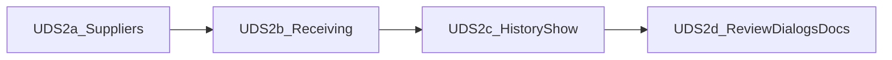

# UDS-2 — Representative screen convergence

Status: **Complete** (UDS-2a–2d landed; Chromium/a11y-matrix evidence still required before matrix **conforming**)

Slice id remains **UDS-2**. Not a Phase 7 domain number. Authority: [UX design system packet](README.md). Foundation: [UDS-1](uds-1-plan.md) (complete).

Companion backlog: [uds-2-user-stories.md](uds-2-user-stories.md).

## Purpose

Migrate a small reference set onto Warm Parchment primitives and `ActionButtonHelper` so later phases have conforming admin, ops, and history examples—without rewriting Register bindings or print.

## Deliverable

> Authorized users see Suppliers, Receiving, completed-transaction history/show, and their consequential review dialogs using shared tokens and explicit action style/intent; domain authorization, services, audit, and printed receipts are unchanged.

## Prerequisites

1. UDS-1 complete (tokens, helper, shared primitives, ADR-022 Implemented).
2. Follow the [implementation rollout contract](program-plan.md#implementation-rollout-contract) for UDS-2 frozen suites and Chromium baselines.
3. Grouped admin navigation remains out until the [navigation prototype gate](navigation-proposal.md#required-prototype-gate) passes.
4. Change only the [UDS-2 allowlist](program-plan.md#slice-change-allowlist); expand only with a same-commit docs update.

## Locked decisions

1. Action labels, style, intent, size, and review stages per [button-action-semantics.md](button-action-semantics.md). No label-inferred danger; helper never injects `confirm()`.
2. Receiving is the ops accessibility/ergonomic reference; Location and Draft PO are **post-UDS-2**.
3. Transaction history: historical snapshots only; **Line details** (not audit logs); Post-Void is danger **outline** page trigger; print selectors locked ([surface-contracts.md](surface-contracts.md)).
4. Shells stay distinct; no Hotwire on admin chrome.
5. Full [accessibility-ergonomic-test-matrix.md](accessibility-ergonomic-test-matrix.md) evidence is required before marking reference rows **conforming**.

## Delivery sub-slices

### UDS-2a — Suppliers (admin CRUD reference)

**Status: done** (shared partials + ActionButtonHelper; turbo_confirm removed; markup assertions in suppliers_admin_test).

- Migrate `app/views/admin/suppliers/{index,show,new,edit,_form}.html.erb` to shared partials + `ActionButtonHelper`.
- Deactivate = warning outline; Reactivate = solid brand; Edit = outline neutral; form Cancel = ghost; Save/Create = solid brand.
- Remove ineffective `data-turbo-confirm` on admin (Turbo off); do not invent a new review dialog unless domain requires it.
- Extend `test/integration/suppliers_admin_test.rb` with parsed action markup assertions (methods, classes, no confirm attribute).

### UDS-2b — Receiving (ops reference)

**Status: done** (allowlisted Receiving views use ActionButtonHelper; review triggers outline / finals solid; shortcuts and Turbo targets preserved).

- Migrate allowlisted Receiving views only; preserve shortcuts, Turbo targets, scanner contracts.
- Explicit intents on submits and review triggers/finals.
- Frozen receiving/system suites stay green.

### UDS-2c — Transaction history / show

**Status: done** (history show + completed-transaction actions via helper; Line details disclosure; print unchanged; allowlist includes `transactions/show` + `_line`).

- Migrate `completed_transactions/show` (and related screen chrome on the allowlist): Reprint / Return / Post-Void outline treatments; Line details disclosure labeling.
- Do not change printed receipt markup or one-line description contract.

### UDS-2d — Review dialogs + matrix exit

**Status: done** (Receiving review dialogs classified in UDS-2b; packet indexes updated; conforming deferred until a11y-matrix evidence).

- Ensure representative review dialogs on allowlisted surfaces use outline triggers and solid danger/warning finals via the helper.
- Update [migration-matrix.md](migration-matrix.md) evidence; leave **conforming** only when a11y-matrix evidence is attached.
- Point program-plan / packet README at UDS-2 progress.

## Out of scope

- Grouped admin navigation / sidebar / Cmd+K.
- Location queue, Draft PO, non-reference admin CRUD families.
- UDS-3 Register basket hierarchy / shortcut regrouping.
- Print selector changes; alias removal / CI bans.
- Domain service, permission, or schema changes.

## Acceptance

1. Four reference surfaces use helper-backed actions and Warm Parchment primitives.
2. Frozen UDS-2 suites green without rewritten workflow assertions.
3. Print smoke unchanged; Register bindings untouched.
4. Matrix updated; conforming only with evidence.
