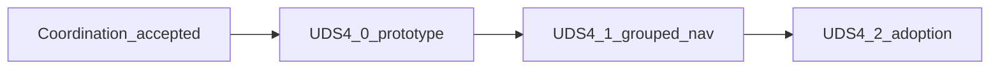

# UDS-4 — Information architecture and adoption

Status: **Complete** on `main` — coordination **Accepted**; UDS-4.0–4.2 shipped. Phase 7.1.3 ops interaction closeout **complete on `main`** (PR #40). Future screen migration belongs to the feature phase that materially changes the screen.

Slice id remains **UDS-4**. Not a domain phase number. Authority: [UX design system packet](README.md), [program-plan.md](program-plan.md), [navigation-proposal.md](navigation-proposal.md).

## Goal

Replace the flat administrative header with permission-aware grouped navigation and continue Warm Parchment / `ActionButtonHelper` adoption on screens **not** owned by Phase 7.1—without inventing routes, permissions, or domain behavior.

## Deliverable

> Authorized staff can reach operational destinations through grouped, permission-filtered navigation without relying on a flat link list, JavaScript-only access, or hidden authorization boundaries.

## Dependency

All UDS-4 implementation slices require:

1. [phase7.1-uds-coordination.md](../phase7.1-purchasing-polish/phase7.1-uds-coordination.md) **Accepted** (August 2026)
2. For UDS-4.1: [navigation prototype gate](navigation-proposal.md#required-prototype-gate) **Passed** ([uds-4.0-gate-evidence.md](uds-4.0-gate-evidence.md))

[program-plan.md](program-plan.md) and [migration-matrix.md](migration-matrix.md) reflect Phase 7.1 / UDS-4 ownership (August 2026).

Phase 7.1 may ship purchasing hub and admin indexes on **flat** nav while UDS-4.0 runs in parallel.

## Merge sequencing (coordination Accepted)

```text
7.1.1 hub + 7.1.2 admin indexes (flat nav)  ∥  UDS-4.0 prototype
→ UDS-4.1 grouped nav (after prototype gate)
→ UDS-4.2 non-purchasing adoption (complete)
→ 7.1.3 ops interaction closeout (complete)
```

See [phase7.1-uds-coordination.md](../phase7.1-purchasing-polish/phase7.1-uds-coordination.md).

## Scope

### In scope

- Grouped nav markup and CSS in admin chrome per navigation-proposal canonical groups
- Navigation view model / helper from code-defined destination list
- Prototype gate profiles A and B
- Cross-cutting adoption on migration-matrix rows **not** assigned to Phase 7.1 in the coordination table
- Non-purchasing cross-link standardization (product ↔ transaction history, etc.)

### Out of scope

- New routes, permissions, or domain commands
- Purchasing work hub logic (Phase 7.1.1)
- Admin orders / PO / receipt template ownership (Phase 7.1.2)
- Ops Location / Draft PO parity (Phase 7.1.3)
- Aspirational roadmap groups without destinations (Buyback, Cash, Reports)—add groups when routes exist
- Hotwire on admin chrome; permanent sidebar; global search ([deferred-patterns.md](deferred-patterns.md))

## Canonical navigation groups

Use [navigation-proposal.md](navigation-proposal.md) inventory until amended:

Merchandise · Inventory · Purchasing · Customers · POS operations · Organization configuration · Security · Audit

Do not rename groups to roadmap aspirational labels in UDS-4.0/4.1 without updating navigation-proposal and this plan.

## Slices



### UDS-4.0 — Navigation prototype and gate

**Status:** **Complete** — gate evidence **Passed** ([uds-4.0-gate-evidence.md](uds-4.0-gate-evidence.md)). Disposable prototype route retired in UDS-4.1.

- Shared [`Admin::NavigationCatalog`](../../../app/services/admin/navigation_catalog.rb) / [`Admin::NavigationViewModel`](../../../app/services/admin/navigation_view_model.rb)
- Profiles A (full admin) and B (narrow store user) per navigation-proposal (hub-aware)
- Automated helper/view tests for visibility, empty groups, `aria-current`

### UDS-4.1 — Ship grouped navigation

**Status:** **Complete** on `main` (PR #38).

- [`application.html.erb`](../../../app/views/layouts/application.html.erb) via [`shared/_admin_primary_nav`](../../../app/views/shared/_admin_primary_nav.html.erb)
- Purchasing hub primary; Orders / PO / Receipt under Purchasing
- Disposable prototype route retired

### UDS-4.2 — Cross-cutting adoption backlog

**Status:** In progress — see [uds-4.2-plan.md](uds-4.2-plan.md).

- Migrate migration-matrix rows explicitly **not** owned by Phase 7.1 coordination table
- Standardize non-purchasing cross-links via `AdminCrossLinksHelper`
- Sub-slices 4.2a–4.2d; each PR cites matrix paths and coordination row compliance

## Relationship to Phase 7.1

| Concern | Owner |
|---|---|
| Nav chrome, group names, prototype gate | UDS-4 |
| Purchasing hub, admin PO/order/receipt indexes, ops parity | Phase 7.1 |
| Cross-link conventions document | Shared; implementation split per coordination table |

See [phase7.1-uds-coordination.md](../phase7.1-purchasing-polish/phase7.1-uds-coordination.md).

## Acceptance criteria

UDS-4 is complete when:

1. Coordination doc Accepted.
2. Prototype gate evidence recorded; grouped nav shipped on `main`.
3. Both permission profiles in navigation-proposal pass manual and automated checks.
4. Phase 7.1-owned screens were not migrated twice or contradicted.
5. [migration-matrix.md](migration-matrix.md) and [program-plan.md](program-plan.md) reflect shipped selectors and remaining backlog.

## Related documents

| Document | Purpose |
|---|---|
| [program-plan.md](program-plan.md) | Rollout contract and foundation exit |
| [navigation-proposal.md](navigation-proposal.md) | Destination inventory and prototype gate |
| [roadmap.md](../roadmap.md) | Forward sequencing |
| [phase7.1-plan.md](../phase7.1-purchasing-polish/phase7.1-plan.md) | Purchasing polish slices |
