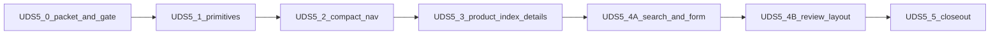

# UDS-5 — Administrative composition

Status: **Proposed** — UDS-5.0 gate **Passed**; UDS-5.1 primitives, UDS-5.2 compact nav, UDS-5.3 Product index/show, and UDS-5.4A catalog search/form complete on the program branch.

Slice id remains **UDS-5**. Not a domain phase number. GitHub tracker: [milestone UDS-5](https://github.com/BankEncore/ShelfSense-v1/milestone/3) ([#44](https://github.com/BankEncore/ShelfSense-v1/issues/44)–[#50](https://github.com/BankEncore/ShelfSense-v1/issues/50)). Authority for later slices is this document; issues do not replace it.

## Goal

Give administrative screens a readable composition grammar (type roles, page header, panels, metric strip, table hierarchy, form sections) and a compact presentation of the **existing** UDS-4 grouped catalog, using Product as the first reference family.

## Deliverable

> Authorized staff can scan Product reference screens and the administrative header for identity, status, and next action without a taller grouped-link wall, a persistent sidebar, or any change to catalog membership, permissions, or domain behavior.

## Branch and merge sequencing

Program branch: `uds-5-administrative-composition` from `main`. Slices land sequentially on that branch. One pull request to `main` after UDS-5.5. UDS-6 and parked UDS-7 stay off this branch.

```text
main
  └─ uds-5-administrative-composition
       ├─ 5.0  packet, mockup labels, nav gate     (#44)  complete
       ├─ 5.1  typography + primitives             (#45)  complete
       ├─ 5.2  compact nav presentation            (#46)  complete
       ├─ 5.3  Product index + details             (#47)  complete
       ├─ 5.4A catalog search + form               (#48)  this slice
       ├─ 5.4B bibliographic review layout         (#49)
       └─ 5.5  evidence + closeout                 (#50)
            └─ PR → main
```

If `main` moves, rebase this branch between slices. Do not mix unrelated `main` work into a UDS-5 commit.

## Shared exclusions

Every UDS-5 slice:

- Sidebar, Cmd/Ctrl+K, and dark espresso utility chrome (parked [UDS-7](https://github.com/BankEncore/ShelfSense-v1/issues/56))
- `Admin::NavigationCatalog` membership, permission predicates, route inventory, destination labels, or group membership
- Register, purchasing-ops shells, printed receipt
- Enrichment policy, ApplyCandidate, provenance writes, cover download, subject matching, `lock_version` handling
- Broad admin-template migration; standing adoption is documented in 5.5, not executed as a sweep

## UDS-5.2 locked boundary

> May change the administrative layout, navigation partial, CSS, and narrowly scoped presentation behavior. Must not change `Admin::NavigationCatalog`, permission predicates, route inventory, destination labels, or group membership.

## Serif policy

Warm Parchment **permits** a display-serif role for brand and top-level titles ([warm-parchment.md](warm-parchment.md)). UDS-5 tests whether to adopt it. Do not treat serif as already accepted. Apply serif only through `--font-serif` and role classes. Record adopt / adjust / reject in UDS-5.5.

## Slices



### UDS-5.0 — Planning packet, mockup labels, and compact-nav prototype gate

**Status:** **Complete** on `uds-5-administrative-composition`. Gate **Passed** ([uds-5.0-gate-evidence.md](uds-5.0-gate-evidence.md)). **No production chrome change.**

- Add this plan, [uds-5-user-stories.md](uds-5-user-stories.md), and [uds-5.0-gate-evidence.md](uds-5.0-gate-evidence.md)
- Label inspirational mockup regions individually (Proposed vs Inspirational/deferred)
- Record Product and header baselines
- Disposable three-variant prototype of the **live** catalog: expanded (control), compact disclosures, optional in-flow area row
- Gate profiles: global administrator with/without store; narrow store-scoped receiving user with/without store; JavaScript disabled; keyboard; 320px; 200%/400% zoom
- Use the live catalog (including Product forms and Subject schemes). Do not freeze the historical “33 destinations” count from the UDS-4 proposal

**5.2 escape hatch:** if neither compact variant passes, 5.2 ships a passing compact alternative or keeps expanded nav. Do not block 5.3 indefinitely.

### UDS-5.1 — Typography and composition primitives

**Status:** **Complete** on `uds-5-administrative-composition`. Tracker [#45](https://github.com/BankEncore/ShelfSense-v1/issues/45). **No Product family composition** (that is 5.3 / 5.4). Production compact nav is unchanged until 5.2.

Local Source Serif 4; `--font-serif` / `--font-mono`; role-based type; `.surface` means panel boundary (`.surface--flush` opts out of the padded compatibility default); extended page-header and form-section; metric strip; table-hierarchy utilities; admin-form sticky footer prototype. Serif only via tokens/role classes. Disposable fixture: `GET /admin/uds5_composition_prototype`.

### UDS-5.2 — Compact administrative navigation presentation

**Status:** **Complete** on `uds-5-administrative-composition`. Tracker [#46](https://github.com/BankEncore/ShelfSense-v1/issues/46). Gate preferred pattern `area_row` shipped. Catalog membership, predicates, labels, and groups unchanged.

Compact utility strip plus an in-flow row of the current group’s destinations. Non-current groups use native `<details>` so every destination remains in the DOM with JavaScript disabled. Light parchment chrome only. Disposable 5.0 prototype route retired.

### UDS-5.3 — Product index and details composition

**Status:** **Complete** on `uds-5-administrative-composition`. Tracker [#47](https://github.com/BankEncore/ShelfSense-v1/issues/47).

Index header/filters/table hierarchy; show identity header, metric strip, identity/publication panels. Operational variant columns stay distinct. No new audit queries. Cover remains a thumbnail. Catalog search and product form shipped in 5.4A; bibliographic review waits for 5.4B.

### UDS-5.4A — Product catalog search and form composition

**Status:** **Complete** on `uds-5-administrative-composition`. Tracker [#48](https://github.com/BankEncore/ShelfSense-v1/issues/48).

Catalog search surface; sectioned product form; related-field grids; sticky admin-form actions. Behavior, params, and validation unchanged.

### UDS-5.4B — Bibliographic review presentation

**Status:** Outlined. Tracker [#49](https://github.com/BankEncore/ShelfSense-v1/issues/49).

Comparison layout only. Freeze ApplyCandidate and provenance tests.

### UDS-5.5 — Evidence and closeout

**Status:** Outlined. Tracker [#50](https://github.com/BankEncore/ShelfSense-v1/issues/50).

Record serif adopt/adjust/reject; update matrix and conventions; add the standing feature-led adoption rule to [ux-conventions.md](../../ux-conventions.md) and [ux-adoption-template.md](ux-adoption-template.md). Print non-regression.

## Change allowlists

Expanding an allowlist requires updating this plan in a preceding or same-commit documentation change.

| Slice | Shared selectors | Helpers / partials / layouts | Reference views |
|---|---|---|---|
| **UDS-5.0** | New selectors under `.uds-5-nav-prototype` only. Do not change production `.app-nav*` rules. | Disposable `Admin::Uds5NavigationPrototypesController` and its views. `config/routes.rb` one GET. Do not change `application.html.erb`, `_admin_primary_nav.html.erb`, `Admin::NavigationCatalog`, or `Admin::NavigationViewModel` behavior. Prototype may pass existing `controller_path:` for area simulation. | None. Product templates are observation-only. Docs and mockup labels. `test/integration/admin_uds5_navigation_prototype_test.rb`; `test/system/admin_uds5_navigation_prototype_test.rb` |
| **UDS-5.1** | `:root` `--font-serif` / `--font-mono`; Source Serif 4 `@font-face`; `.app-brand` serif via CSS only; `.type-*` role classes; `.surface` / `.surface--flush`; `.page-header*` extensions; `.form-section__head` / `__body` / `__grid`; `.form-field--span-2`; `.metric-strip*`; `.data-table .cell-primary` / `.cell-secondary` / `.cell-identifier`; `.admin-form-footer` | `shared/_page_header.html.erb`; `shared/_form_section.html.erb`; `app/assets/fonts/source-serif-4-latin-{400,600}-normal.woff2`; `application.css`; disposable `Admin::Uds5CompositionPrototypesController` and its view; `config/routes.rb` one GET. Do not change `application.html.erb` markup, `Admin::NavigationCatalog`, or Product family templates. | `GET /admin/uds5_composition_prototype`. Product index/show/form composition waits for 5.3 / 5.4. `test/integration/admin_uds5_composition_prototype_test.rb`; `test/system/admin_uds5_composition_prototype_test.rb`; `test/views/page_header_partial_test.rb`; `test/views/form_section_partial_test.rb` |
| **UDS-5.2** | `.app-nav--grouped` compact column layout; `.app-nav__strip`; `.app-nav__area-row`; `details.app-nav-group`; `summary.app-nav-group__heading`; existing `.app-nav-group__heading` / `__list` / `.app-nav-utilities`. Remove `.uds-5-nav-prototype*` | `shared/_admin_primary_nav.html.erb`; `application.css`; `config/routes.rb` (drop 5.0 GET). Do not change `application.html.erb` markup, `Admin::NavigationCatalog`, or `Admin::NavigationViewModel` behavior. | None. Production header. `test/integration/admin_grouped_navigation_test.rb`; `test/system/admin_grouped_navigation_test.rb` |
| **UDS-5.3** | UDS-5.1 primitives consumed on Product index/show; `.product-filters`; `.product-metrics`; `.product-panels`; `.product-variants`; `.data-table .cell-operational` | `admin/products/{index,show}.html.erb` only. Do not change ProductsController queries, catalog search, product form, or bibliographic review. | `admin/products/{index,show}.html.erb`. `test/integration/admin_product_composition_test.rb`; `test/system/admin_product_composition_test.rb` |
| **UDS-5.4A** | UDS-5.1 primitives on catalog search and product form; `.catalog-search-query`; `.catalog-search-results`; `.product-form`; `.product-cover--thumb` | `admin/product_catalog_searches/**`; `admin/products/{new,edit,_form}.html.erb`. Do not change catalog-search params, ranking, ProductsController validation, or bibliographic review. | `admin/product_catalog_searches/new.html.erb`; `admin/products/{new,edit,_form}.html.erb`. `test/integration/admin_product_search_form_composition_test.rb`; `test/system/admin_product_search_form_composition_test.rb` |
| **UDS-5.4B** (draft) | Layout selectors scoped to bibliographic review | Review template only | `admin/products/bibliographic_review.html.erb` |
| **UDS-5.5** | None except docs | Docs, matrix, conventions, adoption template | Evidence only |

5.1–5.5 file lists may be refined in a slice planning session **before** that slice is coded, by editing this table in the same change.

## Prototype contract (5.0)

Route: `GET /admin/uds5_navigation_prototype` (signed-in; no extra permission so Profile B can open it). Not listed in `Admin::NavigationCatalog`.

Query:

- `variant=expanded|disclosures|area_row` (default `expanded`)
- `as_controller=` optional override passed to `NavigationViewModel` (default `admin/products`)

Variants render the **same** view-model destinations:

1. **Expanded** — clone of today’s grouped header (control)
2. **Disclosures** — native `<details>`/`<summary>` per group; current group starts open; every destination remains in the DOM with JavaScript disabled
3. **Area row** — compact group triggers plus an in-flow row of the **current** group’s destinations; other groups stay reachable via disclosure

No Stimulus/Hotwire on the prototype. Light parchment chrome only. Measure `.uds-5-nav-prototype`, not the live `.app-header` (the live header remains production expanded nav).

Retire the route in 5.2 if compact nav ships, or in 5.5 if expanded nav is kept.

**Retired in UDS-5.2.** Production chrome now uses the `area_row` pattern. The disposable controller, views, CSS, and tests are gone.

## Prototype contract (5.1)

Route: `GET /admin/uds5_composition_prototype` (signed-in; no extra permission). Not listed in `Admin::NavigationCatalog`.

The fixture exercises: full page-header slots; omitted subtitle/status; type-role specimens; `.surface` vs `.surface--flush`; metric strip; form-section grid with a static invalid field; sticky `.admin-form-footer`; table cell-primary/secondary/identifier. No Stimulus/Hotwire. Do not apply these primitives to Product templates until 5.3 / 5.4.

Retire the route in 5.3 once Product screens consume the primitives, or in 5.5.

## Gate pass / fail

**Pass:** at least one compact variant preserves UDS-4.1 visibility and current-area semantics, keeps every destination reachable with no JS, and is clearly shorter than expanded at 1440×900 without failing 320px or 200%/400% zoom.

**Fail (allowed):** record it in [uds-5.0-gate-evidence.md](uds-5.0-gate-evidence.md). 5.2 uses the escape hatch. 5.3 is not blocked.

## Frozen tests

Existing domain/workflow tests stay unchanged and passing. 5.2 may update grouped-nav **presentation** assertions. Do not rewrite `navigation_view_model_test` or catalog tests. Do not relax ApplyCandidate / provenance / concurrency tests in any UDS-5 slice.

## Related documents

- [uds-5-user-stories.md](uds-5-user-stories.md)
- [uds-5.0-gate-evidence.md](uds-5.0-gate-evidence.md)
- Fixture: `GET /admin/uds5_composition_prototype` (UDS-5.1)
- [navigation-proposal.md](navigation-proposal.md)
- [deferred-patterns.md](deferred-patterns.md)
- [warm-parchment.md](warm-parchment.md)
- [program-plan.md](program-plan.md)
- [surface-contracts.md](surface-contracts.md) (history remains UDS-6)
