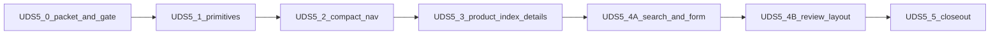

# UDS-5 — Administrative composition

Status: **Proposed** — packet and compact-nav prototype gate are UDS-5.0. Production chrome is unchanged until UDS-5.2.

Slice id remains **UDS-5**. Not a domain phase number. GitHub tracker: [milestone UDS-5](https://github.com/BankEncore/ShelfSense-v1/milestone/3) ([#44](https://github.com/BankEncore/ShelfSense-v1/issues/44)–[#50](https://github.com/BankEncore/ShelfSense-v1/issues/50)). Authority for later slices is this document; issues do not replace it.

## Goal

Give administrative screens a readable composition grammar (type roles, page header, panels, metric strip, table hierarchy, form sections) and a compact presentation of the **existing** UDS-4 grouped catalog, using Product as the first reference family.

## Deliverable

> Authorized staff can scan Product reference screens and the administrative header for identity, status, and next action without a taller grouped-link wall, a persistent sidebar, or any change to catalog membership, permissions, or domain behavior.

## Branch and merge sequencing

Program branch: `uds-5-administrative-composition` from `main`. Slices land sequentially on that branch. One pull request to `main` after UDS-5.5. UDS-6 and parked UDS-7 stay off this branch.

```text
main
  └─ uds-5-administrative-composition
       ├─ 5.0  packet, mockup labels, nav gate     (#44)  this slice
       ├─ 5.1  typography + primitives             (#45)
       ├─ 5.2  compact nav presentation            (#46)  only if 5.0 gate passes
       ├─ 5.3  Product index + details             (#47)
       ├─ 5.4A catalog search + form               (#48)
       ├─ 5.4B bibliographic review layout         (#49)
       └─ 5.5  evidence + closeout                 (#50)
            └─ PR → main
```

If `main` moves, rebase this branch between slices. Do not mix unrelated `main` work into a UDS-5 commit.

## Shared exclusions

Every UDS-5 slice:

- Sidebar, Cmd/Ctrl+K, and dark espresso utility chrome (parked [UDS-7](https://github.com/BankEncore/ShelfSense-v1/issues/56))
- `Admin::NavigationCatalog` membership, permission predicates, route inventory, destination labels, or group membership
- Register, purchasing-ops shells, printed receipt
- Enrichment policy, ApplyCandidate, provenance writes, cover download, subject matching, `lock_version` handling
- Broad admin-template migration; standing adoption is documented in 5.5, not executed as a sweep

## UDS-5.2 locked boundary

> May change the administrative layout, navigation partial, CSS, and narrowly scoped presentation behavior. Must not change `Admin::NavigationCatalog`, permission predicates, route inventory, destination labels, or group membership.

## Serif policy

Warm Parchment **permits** a display-serif role for brand and top-level titles ([warm-parchment.md](warm-parchment.md)). UDS-5 tests whether to adopt it. Do not treat serif as already accepted. Apply serif only through `--font-serif` and role classes. Record adopt / adjust / reject in UDS-5.5.

## Slices



### UDS-5.0 — Planning packet, mockup labels, and compact-nav prototype gate

**Status:** **Complete** on `uds-5-administrative-composition`. Gate **Passed** ([uds-5.0-gate-evidence.md](uds-5.0-gate-evidence.md)). **No production chrome change.**

- Add this plan, [uds-5-user-stories.md](uds-5-user-stories.md), and [uds-5.0-gate-evidence.md](uds-5.0-gate-evidence.md)
- Label inspirational mockup regions individually (Proposed vs Inspirational/deferred)
- Record Product and header baselines
- Disposable three-variant prototype of the **live** catalog: expanded (control), compact disclosures, optional in-flow area row
- Gate profiles: global administrator with/without store; narrow store-scoped receiving user with/without store; JavaScript disabled; keyboard; 320px; 200%/400% zoom
- Use the live catalog (including Product forms and Subject schemes). Do not freeze the historical “33 destinations” count from the UDS-4 proposal

**5.2 escape hatch:** if neither compact variant passes, 5.2 ships a passing compact alternative or keeps expanded nav. Do not block 5.3 indefinitely.

### UDS-5.1 — Typography and composition primitives

**Status:** Outlined. Plan in detail after 5.0 lands. Tracker [#45](https://github.com/BankEncore/ShelfSense-v1/issues/45).

Local Source Serif 4; `--font-serif` / `--font-mono`; role-based type; one documented `.surface` meaning; extend page-header and form-section; metric strip; table-hierarchy utilities; admin-form footer prototype. Serif only via tokens/role classes.

### UDS-5.2 — Compact administrative navigation presentation

**Status:** Outlined. Requires 5.0 gate **passed** (or recorded fail + alternative). Tracker [#46](https://github.com/BankEncore/ShelfSense-v1/issues/46).

Compact utility + area-row presentation of the existing grouped catalog. Allowlist: `application.html.erb`, `_admin_primary_nav.html.erb`, CSS, tests, docs. JavaScript may enhance; every destination remains reachable with no JS. Light chrome only. Retire the 5.0 disposable route when production presentation ships, or in 5.5 if expanded nav is kept.

### UDS-5.3 — Product index and details composition

**Status:** Outlined. Tracker [#47](https://github.com/BankEncore/ShelfSense-v1/issues/47).

Index header/filters/table hierarchy; show identity header, metric strip, identity/publication panels. Keep operational variant columns distinct. No new audit queries. Cover remains a thumbnail.

### UDS-5.4A — Product catalog search and form composition

**Status:** Outlined. Tracker [#48](https://github.com/BankEncore/ShelfSense-v1/issues/48).

Catalog search surface; sectioned product form; related-field grids; sticky admin-form actions. Behavior, params, and validation unchanged.

### UDS-5.4B — Bibliographic review presentation

**Status:** Outlined. Tracker [#49](https://github.com/BankEncore/ShelfSense-v1/issues/49).

Comparison layout only. Freeze ApplyCandidate and provenance tests.

### UDS-5.5 — Evidence and closeout

**Status:** Outlined. Tracker [#50](https://github.com/BankEncore/ShelfSense-v1/issues/50).

Record serif adopt/adjust/reject; update matrix and conventions; add the standing feature-led adoption rule to [ux-conventions.md](../../ux-conventions.md) and [ux-adoption-template.md](ux-adoption-template.md). Print non-regression.

## Change allowlists

Expanding an allowlist requires updating this plan in a preceding or same-commit documentation change.

| Slice | Shared selectors | Helpers / partials / layouts | Reference views |
|---|---|---|---|
| **UDS-5.0** | New selectors under `.uds-5-nav-prototype` only. Do not change production `.app-nav*` rules. | Disposable `Admin::Uds5NavigationPrototypesController` and its views. `config/routes.rb` one GET. Do not change `application.html.erb`, `_admin_primary_nav.html.erb`, `Admin::NavigationCatalog`, or `Admin::NavigationViewModel` behavior. Prototype may pass existing `controller_path:` for area simulation. | None. Product templates are observation-only. Docs and mockup labels. `test/integration/admin_uds5_navigation_prototype_test.rb`; `test/system/admin_uds5_navigation_prototype_test.rb` |
| **UDS-5.1** (draft) | `:root` font tokens; heading/brand/record-title role classes; `.surface` meaning plus compatibility modifier; page-header extensions; form-section; metric-strip; table-hierarchy; admin-form footer prototype | `shared/_page_header.html.erb`; `shared/_form_section.html.erb`; font packaging under Propshaft | One named fixture or reference surface to exercise primitives. Product family composition waits for 5.3 |
| **UDS-5.2** (draft) | Compact grouped-nav selectors named in the 5.2 slice plan | `application.html.erb`; `_admin_primary_nav.html.erb`; CSS; tests; docs. **Locked boundary above.** | None |
| **UDS-5.3** (draft) | UDS-5.1 primitives on Product index/show | Product index/show templates and partials they already render | `admin/products/{index,show}.html.erb` |
| **UDS-5.4A** (draft) | UDS-5.1 primitives on search and form | Catalog search and product form templates | `admin/product_catalog_searches/**`; `admin/products/{new,edit,_form}.html.erb` |
| **UDS-5.4B** (draft) | Layout selectors scoped to bibliographic review | Review template only | `admin/products/bibliographic_review.html.erb` |
| **UDS-5.5** | None except docs | Docs, matrix, conventions, adoption template | Evidence only |

5.1–5.5 file lists may be refined in a slice planning session **before** that slice is coded, by editing this table in the same change.

## Prototype contract (5.0)

Route: `GET /admin/uds5_navigation_prototype` (signed-in; no extra permission so Profile B can open it). Not listed in `Admin::NavigationCatalog`.

Query:

- `variant=expanded|disclosures|area_row` (default `expanded`)
- `as_controller=` optional override passed to `NavigationViewModel` (default `admin/products`)

Variants render the **same** view-model destinations:

1. **Expanded** — clone of today’s grouped header (control)
2. **Disclosures** — native `<details>`/`<summary>` per group; current group starts open; every destination remains in the DOM with JavaScript disabled
3. **Area row** — compact group triggers plus an in-flow row of the **current** group’s destinations; other groups stay reachable via disclosure

No Stimulus/Hotwire on the prototype. Light parchment chrome only. Measure `.uds-5-nav-prototype`, not the live `.app-header` (the live header remains production expanded nav).

Retire the route in 5.2 if compact nav ships, or in 5.5 if expanded nav is kept.

## Gate pass / fail

**Pass:** at least one compact variant preserves UDS-4.1 visibility and current-area semantics, keeps every destination reachable with no JS, and is clearly shorter than expanded at 1440×900 without failing 320px or 200%/400% zoom.

**Fail (allowed):** record it in [uds-5.0-gate-evidence.md](uds-5.0-gate-evidence.md). 5.2 uses the escape hatch. 5.3 is not blocked.

## Frozen tests

Existing domain/workflow tests stay unchanged and passing. 5.0 may add prototype integration coverage. Do not rewrite `navigation_view_model_test` or catalog tests. Do not relax ApplyCandidate / provenance / concurrency tests in any UDS-5 slice.

## Related documents

- [uds-5-user-stories.md](uds-5-user-stories.md)
- [uds-5.0-gate-evidence.md](uds-5.0-gate-evidence.md)
- [navigation-proposal.md](navigation-proposal.md)
- [deferred-patterns.md](deferred-patterns.md)
- [warm-parchment.md](warm-parchment.md)
- [program-plan.md](program-plan.md)
- [surface-contracts.md](surface-contracts.md) (history remains UDS-6)
